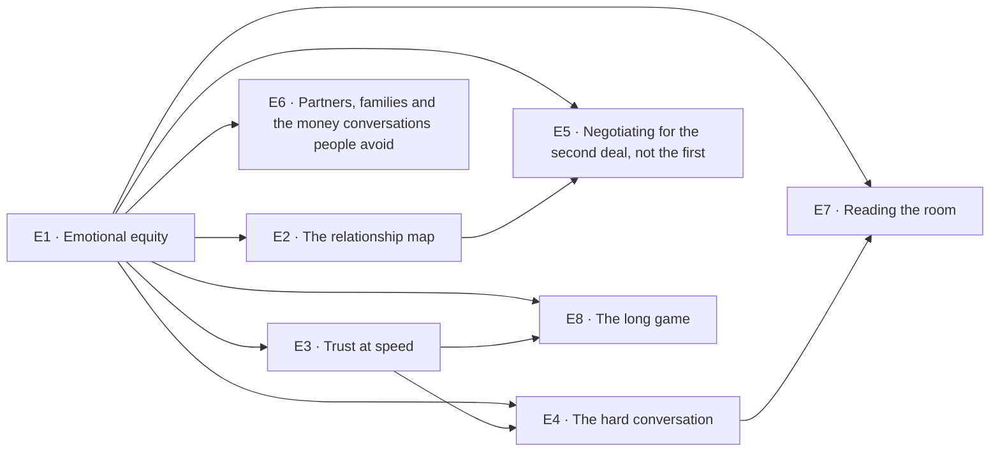

# Emotional equity & relationships

> Pillar 01 of 8 · **8 items** (7 courses, 1 guides) · **40 modules** · all 8 live

The slab under everything else, not a pillar you finish. Trust is treated as a capital account: deposited, drawn down, compounding or not. Every other pillar assumes you can get a seller to talk, a lender to stretch, and a contractor to tell you bad news early — this is where those abilities are built.

Source of truth: [`curriculum/curriculum.py`](../curriculum.py). [`curriculum-50.csv`](../curriculum-50.csv) is derived from it, and so is this page. Status is derived by `status_of()`, never stored; [`validate.py`](../validate.py) gates every build on the eight checks. Edit curriculum.py, not this file and not the CSV — regenerate with `python3 curriculum/gen_courses.py`, as noted in [`README.md`](README.md).

## At a glance

| ID | Level | Title | Kind | Modules | Prerequisites |
|----|-------|-------|------|---------|---------------|
| **E1** | 1 | Emotional equity: the balance sheet nobody keeps | course | 5 | — |
| **E2** | 1 | The relationship map: who actually moves your deals | course | 5 | E1 |
| **E3** | 2 | Trust at speed: how reputation prices your terms | course | 5 | E1 |
| **E4** | 3 | The hard conversation: money, delay and bad news | course | 5 | E1, E3 |
| **E5** | 2 | Negotiating for the second deal, not the first | course | 5 | E1, E2 |
| **E6** | 4 | Partners, families and the money conversations people avoid | course | 5 | E1 |
| **E7** | 3 | Reading the room: emotion as market information | course | 5 | E1, E4 |
| **E8** | 4 | The long game: mentors, referrals and compounding goodwill | guide | 5 | E1, E3 |

## Prerequisite flow

## Level 1 — Orientation

*First contact: vocabulary, the income streams, the platform's numbers.*

### E1 — Emotional equity: the balance sheet nobody keeps

*Course · 5 modules · status: live*

**The promise.** Treat trust as a capital account — it is deposited, drawn down, and it compounds or it does not.

**Where it lands in the product:** The Record Locker — the same discipline of writing down what happened, applied to people.

**Backing tracks:** `equity mindset`

### E2 — The relationship map: who actually moves your deals

*Course · 5 modules · status: live*

**The promise.** Draw the eight people who decide whether your next deal happens, and what each of them needs from you.

**Take first:** **E1** (Emotional equity: the balance sheet nobody keeps).

**Where it lands in the product:** Investment & development i3 — the eight actors and six gates.

**Backing tracks:** `equity`

## Level 2 — Practitioner

*Working skills: the buy box, survival numbers, coverage, the relationship map in practice.*

### E3 — Trust at speed: how reputation prices your terms

*Course · 5 modules · status: live*

**The promise.** Why the same deal gets different terms for different people, and how that gap is earned.

**Take first:** **E1** (Emotional equity: the balance sheet nobody keeps).

**Where it lands in the product:** Delivering the project p5 — leading people who do not work for you.

**Backing tracks:** `equity`

### E5 — Negotiating for the second deal, not the first

*Course · 5 modules · status: live*

**The promise.** Terms are set once; relationships are priced every time. Negotiate for the sequence.

**Take first:** **E1** (Emotional equity: the balance sheet nobody keeps), **E2** (The relationship map: who actually moves your deals).

**Where it lands in the product:** Investor mindset m3 — anchoring at the negotiation table.

**Backing tracks:** `equity`

## Level 3 — Operator

*Running deals: entitlement, feasibility, pro formas, the lender's triangle, hard conversations.*

### E4 — The hard conversation: money, delay and bad news

*Course · 5 modules · status: live*

**The promise.** The skill that separates operators who survive a bad year from those who do not.

**Take first:** **E1** (Emotional equity: the balance sheet nobody keeps), **E3** (Trust at speed: how reputation prices your terms).

**Where it lands in the product:** Delivering the project p7 — the risk register and the trigger written while calm.

**Backing tracks:** `equity`

### E7 — Reading the room: emotion as market information

*Course · 5 modules · status: live*

**The promise.** A seller's urgency, a lender's nervousness and a contractor's hesitation are data.

**Take first:** **E1** (Emotional equity: the balance sheet nobody keeps), **E4** (The hard conversation: money, delay and bad news).

**Where it lands in the product:** Evidence & analysis e2 — framing before querying; the coverage floor.

**Backing tracks:** `equity`

## Level 4 — Principal

*Structuring and judgment: waterfalls, capital markets, partnerships, the exit, the thesis.*

### E6 — Partners, families and the money conversations people avoid

*Course · 5 modules · status: live*

**The promise.** Most partnerships fail on unspoken expectations, not on the deal.

**Take first:** **E1** (Emotional equity: the balance sheet nobody keeps).

**Where it lands in the product:** Investment & development i7 — control rights and the unpriced unknown.

**Backing tracks:** `equity`

### E8 — The long game: mentors, referrals and compounding goodwill

*Guide · 5 modules · status: live*

**The promise.** How a decade of small deposits becomes deal flow you did not have to chase.

**Take first:** **E1** (Emotional equity: the balance sheet nobody keeps), **E3** (Trust at speed: how reputation prices your terms).

**Where it lands in the product:** The Academy's own case-study discipline — judge the decision, not the outcome.

**Backing tracks:** `equity`
