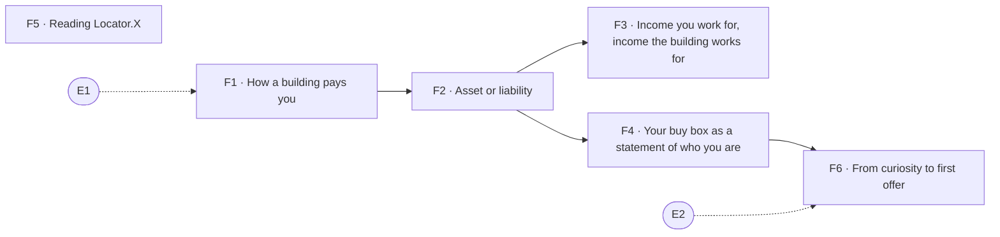

# Foundations & the Locator.X doctrine

> Pillar 02 of 8 · **6 items** (4 courses, 2 guides) · **24 modules** · all 6 live

How a building pays you, the asset-or-liability test, and how to read every number the platform shows — including the ones it refuses to show. This pillar is the doctrine the product is built on: the buy box, the evidence grade, and the 90-day path from curiosity to a written offer.

Source of truth: [`curriculum/curriculum.py`](../curriculum.py). [`curriculum-50.csv`](../curriculum-50.csv) is derived from it, and so is this page. Status is derived by `status_of()`, never stored; [`validate.py`](../validate.py) gates every build on the eight checks. Edit curriculum.py, not this file and not the CSV — regenerate with `python3 curriculum/gen_courses.py`, as noted in [`README.md`](README.md).

## At a glance

| ID | Level | Title | Kind | Modules | Prerequisites |
|----|-------|-------|------|---------|---------------|
| **F1** | 1 | How a building pays you | course | 4 | E1 |
| **F2** | 1 | Asset or liability: the Locator.X test | course | 4 | F1 |
| **F3** | 1 | Income you work for, income the building works for | course | 4 | F2 |
| **F4** | 2 | Your buy box as a statement of who you are | course | 4 | F2 |
| **F5** | 1 | Reading Locator.X: score, evidence grade, coverage | guide | 4 | — |
| **F6** | 2 | From curiosity to first offer: the 90-day path | guide | 4 | F4, E2 |

## Prerequisite flow

Dashed nodes are prerequisites from other pillars: **E1** (Emotional equity: the balance sheet nobody keeps, Emotional equity & relationships), **E2** (The relationship map: who actually moves your deals, Emotional equity & relationships).

## Level 1 — Orientation

*First contact: vocabulary, the income streams, the platform's numbers.*

### F1 — How a building pays you

*Course · 4 modules · status: live*

**The promise.** Four income streams, and why treating them as interchangeable is the first expensive mistake.

**Take first:** **E1** (Emotional equity: the balance sheet nobody keeps).

**Where it lands in the product:** Foundations f1 — a building pays four different ways.

**Backing tracks:** `found`

### F2 — Asset or liability: the Locator.X test

*Course · 4 modules · status: live*

**The promise.** Name, source and defend the cash flows before you own it — or you have a position, not an asset.

**Take first:** **F1** (How a building pays you).

**Where it lands in the product:** The dashboard's asset / liability verdict.

**Backing tracks:** `found`

### F3 — Income you work for, income the building works for

*Course · 4 modules · status: live*

**The promise.** The distinction that decides whether you are buying a job or an asset.

**Take first:** **F2** (Asset or liability: the Locator.X test).

**Where it lands in the product:** Foundations f3.

**Backing tracks:** `found`

### F5 — Reading Locator.X: score, evidence grade, coverage

*Guide · 4 modules · status: live*

**The promise.** How to read every number this platform shows you, including the ones it refuses to show.

**Where it lands in the product:** The Evidence and Standard tabs.

**Backing tracks:** `evidence`

## Level 2 — Practitioner

*Working skills: the buy box, survival numbers, coverage, the relationship map in practice.*

### F4 — Your buy box as a statement of who you are

*Course · 4 modules · status: live*

**The promise.** A filter with no edge behind any line is a wish list. Write one you can defend.

**Take first:** **F2** (Asset or liability: the Locator.X test).

**Where it lands in the product:** The Underwrite tab's buy box and the N-of-Y counter.

**Backing tracks:** `deliver found`

### F6 — From curiosity to first offer: the 90-day path

*Guide · 4 modules · status: live*

**The promise.** A sequenced plan that ends in a written offer, not in more reading.

**Take first:** **F4** (Your buy box as a statement of who you are), **E2** (The relationship map: who actually moves your deals).

**Where it lands in the product:** The full underwriting → decision-memo → Record Locker flow.

**Backing tracks:** `wider`
