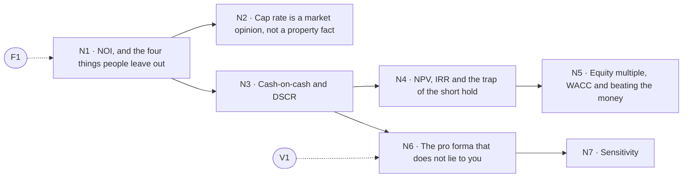

# The numbers

> Pillar 03 of 8 · **7 items** (7 courses, 0 guides) · **28 modules** · all 7 live

NOI to sensitivity analysis, in order of consequence. The sequence runs from the number every valuation rests on (NOI) through the two survival numbers (cash-on-cash, DSCR) to the pro forma that does not lie and the one input that actually decides the outcome.

Source of truth: [`curriculum/curriculum.py`](../curriculum.py). [`curriculum-50.csv`](../curriculum-50.csv) is derived from it, and so is this page. Status is derived by `status_of()`, never stored; [`validate.py`](../validate.py) gates every build on the eight checks. Edit curriculum.py, not this file and not the CSV — regenerate with `python3 curriculum/gen_courses.py`, as noted in [`README.md`](README.md).

## At a glance

| ID | Level | Title | Kind | Modules | Prerequisites |
|----|-------|-------|------|---------|---------------|
| **N1** | 1 | NOI, and the four things people leave out | course | 4 | F1 |
| **N2** | 1 | Cap rate is a market opinion, not a property fact | course | 4 | N1 |
| **N3** | 2 | Cash-on-cash and DSCR: the two survival numbers | course | 4 | N1 |
| **N4** | 2 | NPV, IRR and the trap of the short hold | course | 4 | N3 |
| **N5** | 4 | Equity multiple, WACC and beating the money | course | 4 | N4 |
| **N6** | 3 | The pro forma that does not lie to you | course | 4 | N3, V1 |
| **N7** | 3 | Sensitivity: which input actually decides | course | 4 | N6 |

## Prerequisite flow

Dashed nodes are prerequisites from other pillars: **F1** (How a building pays you, Foundations & the Locator.X doctrine), **V1** (Framing the question before you touch the data, Evidence, data & judgment).

## Level 1 — Orientation

*First contact: vocabulary, the income streams, the platform's numbers.*

### N1 — NOI, and the four things people leave out

*Course · 4 modules · status: live*

**The promise.** The number every valuation rests on, and the expenses that quietly are not in it.

**Take first:** **F1** (How a building pays you).

**Where it lands in the product:** Reading the numbers r1.

**Backing tracks:** `read`

### N2 — Cap rate is a market opinion, not a property fact

*Course · 4 modules · status: live*

**The promise.** What a cap rate actually measures, and why the exit one is somebody else's decision.

**Take first:** **N1** (NOI, and the four things people leave out).

**Where it lands in the product:** Reading the numbers r2; the Outlook exit assumptions.

**Backing tracks:** `read`

## Level 2 — Practitioner

*Working skills: the buy box, survival numbers, coverage, the relationship map in practice.*

### N3 — Cash-on-cash and DSCR: the two survival numbers

*Course · 4 modules · status: live*

**The promise.** The two figures that decide whether you keep the building through a bad year.

**Take first:** **N1** (NOI, and the four things people leave out).

**Where it lands in the product:** The break-even solver at DSCR 1.20.

**Backing tracks:** `read`

### N4 — NPV, IRR and the trap of the short hold

*Course · 4 modules · status: live*

**The promise.** Why a 31% IRR on nine months and a 14% on seven years are not comparable businesses.

**Take first:** **N3** (Cash-on-cash and DSCR: the two survival numbers).

**Where it lands in the product:** Investment & development i1; Graduate g2.

**Backing tracks:** `invdev grad`

## Level 3 — Operator

*Running deals: entitlement, feasibility, pro formas, the lender's triangle, hard conversations.*

### N6 — The pro forma that does not lie to you

*Course · 4 modules · status: live*

**The promise.** Building a projection whose assumptions are visible, sourced and challengeable.

**Take first:** **N3** (Cash-on-cash and DSCR: the two survival numbers), **V1** (Framing the question before you touch the data).

**Where it lands in the product:** The Underwrite financing sheets.

**Backing tracks:** `wider`

### N7 — Sensitivity: which input actually decides

*Course · 4 modules · status: live*

**The promise.** Find the one variable that moves the outcome, and whether you control it.

**Take first:** **N6** (The pro forma that does not lie to you).

**Where it lands in the product:** The Outlook break-even solver.

**Backing tracks:** `wider`

## Level 4 — Principal

*Structuring and judgment: waterfalls, capital markets, partnerships, the exit, the thesis.*

### N5 — Equity multiple, WACC and beating the money

*Course · 4 modules · status: live*

**The promise.** Beating zero is not the test. Beating the capital you used is.

**Take first:** **N4** (NPV, IRR and the trap of the short hold).

**Where it lands in the product:** Investment & development i1.

**Backing tracks:** `invdev`
