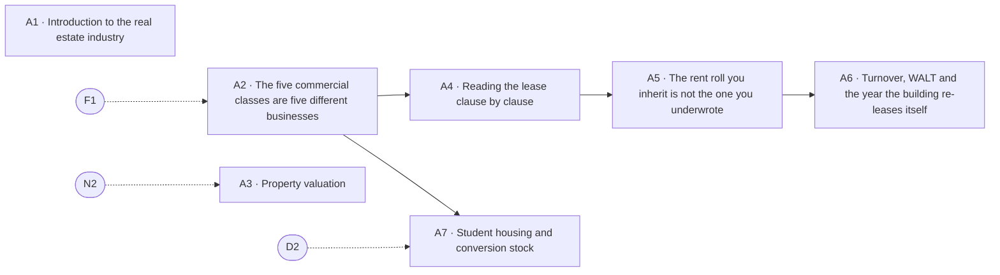

# The asset

> Pillar 04 of 8 · **7 items** (6 courses, 1 guides) · **28 modules** · all 7 live

The physical and legal thing you are buying: the five commercial classes as five different businesses, valuation approaches and when each fails, the lease clause by clause, the rent roll you actually inherit, and conversion stock whose recorded use is not its best use.

Source of truth: [`curriculum/curriculum-50.csv`](../curriculum-50.csv) and [`curriculum/curriculum.py`](../curriculum.py). Status is derived by `status_of()`, never stored; [`validate.py`](../validate.py) gates every build on the eight checks. Edit the source, not this file — regenerate with `python3 curriculum/gen_courses.py`, as noted in [`README.md`](README.md).

## At a glance

| ID | Level | Title | Kind | Modules | Prerequisites |
|----|-------|-------|------|---------|---------------|
| **A1** | 1 | Introduction to the real estate industry | guide | 4 | — |
| **A2** | 1 | The five commercial classes are five different businesses | course | 4 | F1 |
| **A3** | 2 | Property valuation: three approaches and when each fails | course | 4 | N2 |
| **A4** | 2 | Reading the lease clause by clause | course | 4 | A2 |
| **A5** | 2 | The rent roll you inherit is not the one you underwrote | course | 4 | A4 |
| **A6** | 3 | Turnover, WALT and the year the building re-leases itself | course | 4 | A5 |
| **A7** | 4 | Student housing and conversion stock | course | 4 | A2, D2 |

## Prerequisite flow

Dashed nodes are prerequisites from other pillars: **D2** (Zoning: density, height and coverage are three limits, Development & delivery), **F1** (How a building pays you, Foundations & the Locator.X doctrine), **N2** (Cap rate is a market opinion, not a property fact, The numbers).

## Level 1 — Orientation

*First contact: vocabulary, the income streams, the platform's numbers.*

### A1 — Introduction to the real estate industry

*Guide · 4 modules · status: live*

**The promise.** Who does what, who pays whom, and where you fit.

**Where it lands in the product:** The Program tab's tiers and roles.

**Backing tracks:** `wider`

### A2 — The five commercial classes are five different businesses

*Course · 4 modules · status: live*

**The promise.** Lease length is the real difference between multifamily, office, retail, industrial and hospitality.

**Take first:** **F1** (How a building pays you).

**Where it lands in the product:** Investment & development i2; the use-code map.

**Backing tracks:** `invdev`

## Level 2 — Practitioner

*Working skills: the buy box, survival numbers, coverage, the relationship map in practice.*

### A3 — Property valuation: three approaches and when each fails

*Course · 4 modules · status: live*

**The promise.** Income, sales comparison and cost — and the conditions that break each one.

**Take first:** **N2** (Cap rate is a market opinion, not a property fact).

**Where it lands in the product:** The Comps desk, and why it cannot function in Orleans or EBR.

**Backing tracks:** `wider`

### A4 — Reading the lease clause by clause

*Course · 4 modules · status: live*

**The promise.** The document where the money actually lives.

**Take first:** **A2** (The five commercial classes are five different businesses).

**Where it lands in the product:** Investment & development i4.

**Backing tracks:** `invdev`

### A5 — The rent roll you inherit is not the one you underwrote

*Course · 4 modules · status: live*

**The promise.** What changes between the offer and the first month of ownership.

**Take first:** **A4** (Reading the lease clause by clause).

**Where it lands in the product:** Operations o1.

**Backing tracks:** `ops`

## Level 3 — Operator

*Running deals: entitlement, feasibility, pro formas, the lender's triangle, hard conversations.*

### A6 — Turnover, WALT and the year the building re-leases itself

*Course · 4 modules · status: live*

**The promise.** Rollover arrives with commissions, downtime and capital at the same moment.

**Take first:** **A5** (The rent roll you inherit is not the one you underwrote).

**Where it lands in the product:** Operations o3; Investment & development i4.

**Backing tracks:** `ops`

## Level 4 — Principal

*Structuring and judgment: waterfalls, capital markets, partnerships, the exit, the thesis.*

### A7 — Student housing and conversion stock

*Course · 4 modules · status: live*

**The promise.** Buildings whose recorded use is not their best use — and the campus ring that prices them.

**Take first:** **A2** (The five commercial classes are five different businesses), **D2** (Zoning: density, height and coverage are three limits).

**Where it lands in the product:** The conversion engine and the campus layer.

**Backing tracks:** `ops`
