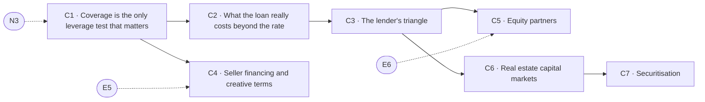

# Capital & structure

> Pillar 05 of 8 · **7 items** (6 courses, 1 guides) · **28 modules** · all 7 live

Where the money comes from and what it really costs. Coverage as the only leverage test that matters, the loan beyond the rate, the lender's triangle, seller financing, equity waterfalls, and the capital-markets plumbing that prices your exit.

Source of truth: [`curriculum/curriculum.py`](../curriculum.py). [`curriculum-50.csv`](../curriculum-50.csv) is derived from it, and so is this page. Status is derived by `status_of()`, never stored; [`validate.py`](../validate.py) gates every build on the eight checks. Edit curriculum.py, not this file and not the CSV — regenerate with `python3 curriculum/gen_courses.py`, as noted in [`README.md`](README.md).

## At a glance

| ID | Level | Title | Kind | Modules | Prerequisites |
|----|-------|-------|------|---------|---------------|
| **C1** | 2 | Coverage is the only leverage test that matters | course | 4 | N3 |
| **C2** | 2 | What the loan really costs beyond the rate | course | 4 | C1 |
| **C3** | 3 | The lender's triangle: LTV, DSCR and debt yield | course | 4 | C2 |
| **C4** | 3 | Seller financing and creative terms | course | 4 | C1, E5 |
| **C5** | 4 | Equity partners: pref, promote and the waterfall | course | 4 | C3, E6 |
| **C6** | 4 | Real estate capital markets: public and private | course | 4 | C3 |
| **C7** | 4 | Securitisation: how a mortgage becomes a security | guide | 4 | C6 |

## Prerequisite flow

Dashed nodes are prerequisites from other pillars: **E5** (Negotiating for the second deal, not the first, Emotional equity & relationships), **E6** (Partners, families and the money conversations people avoid, Emotional equity & relationships), **N3** (Cash-on-cash and DSCR: the two survival numbers, The numbers).

## Level 2 — Practitioner

*Working skills: the buy box, survival numbers, coverage, the relationship map in practice.*

### C1 — Coverage is the only leverage test that matters

*Course · 4 modules · status: live*

**The promise.** Loan-to-value describes the past. Coverage describes whether you survive.

**Take first:** **N3** (Cash-on-cash and DSCR: the two survival numbers).

**Where it lands in the product:** Capital c1; the break-even solver.

**Backing tracks:** `capital lev`

### C2 — What the loan really costs beyond the rate

*Course · 4 modules · status: live*

**The promise.** Points, term, amortisation, recourse, prepayment and the covenants nobody reads.

**Take first:** **C1** (Coverage is the only leverage test that matters).

**Where it lands in the product:** Leverage l2.

**Backing tracks:** `lev`

## Level 3 — Operator

*Running deals: entitlement, feasibility, pro formas, the lender's triangle, hard conversations.*

### C3 — The lender's triangle: LTV, DSCR and debt yield

*Course · 4 modules · status: live*

**The promise.** Three constraints, one binding at a time — and which one changes with the cycle.

**Take first:** **C2** (What the loan really costs beyond the rate).

**Where it lands in the product:** Investment & development i5.

**Backing tracks:** `invdev`

### C4 — Seller financing and creative terms

*Course · 4 modules · status: live*

**The promise.** The seller is a lender you have not asked yet.

**Take first:** **C1** (Coverage is the only leverage test that matters), **E5** (Negotiating for the second deal, not the first).

**Where it lands in the product:** Capital c2.

**Backing tracks:** `capital`

## Level 4 — Principal

*Structuring and judgment: waterfalls, capital markets, partnerships, the exit, the thesis.*

### C5 — Equity partners: pref, promote and the waterfall

*Course · 4 modules · status: live*

**The promise.** What a GP is really selling, and where the money actually ends up.

**Take first:** **C3** (The lender's triangle: LTV, DSCR and debt yield), **E6** (Partners, families and the money conversations people avoid).

**Where it lands in the product:** Investment & development i7.

**Backing tracks:** `invdev`

### C6 — Real estate capital markets: public and private

*Course · 4 modules · status: live*

**The promise.** Where the money that prices your exit actually comes from.

**Take first:** **C3** (The lender's triangle: LTV, DSCR and debt yield).

**Where it lands in the product:** Graduate g4.

**Backing tracks:** `grad`

### C7 — Securitisation: how a mortgage becomes a security

*Guide · 4 modules · status: live*

**The promise.** The plumbing behind commercial lending, and why it decides your terms.

**Take first:** **C6** (Real estate capital markets: public and private).

**Where it lands in the product:** Graduate g4.

**Backing tracks:** `wider`
