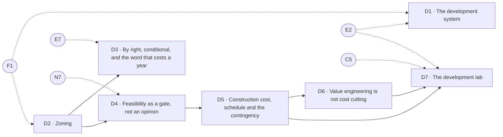

# Development & delivery

> Pillar 06 of 8 · **7 items** (7 courses, 0 guides) · **29 modules** · all 7 live

Eight actors, six gates, and the discipline of sequencing cheap reversible steps ahead of expensive irreversible ones. Zoning as three separate limits, entitlement risk, feasibility as a gate with kill criteria, construction cost and contingency, value engineering, and a lab that carries one parcel start to finish.

Source of truth: [`curriculum/curriculum.py`](../curriculum.py). [`curriculum-50.csv`](../curriculum-50.csv) is derived from it, and so is this page. Status is derived by `status_of()`, never stored; [`validate.py`](../validate.py) gates every build on the eight checks. Edit curriculum.py, not this file and not the CSV — regenerate with `python3 curriculum/gen_courses.py`, as noted in [`README.md`](README.md).

## At a glance

| ID | Level | Title | Kind | Modules | Prerequisites |
|----|-------|-------|------|---------|---------------|
| **D1** | 3 | The development system: eight actors, six gates | course | 4 | F1, E2 |
| **D2** | 3 | Zoning: density, height and coverage are three limits | course | 4 | F1 |
| **D3** | 3 | By right, conditional, and the word that costs a year | course | 4 | D2, E7 |
| **D4** | 3 | Feasibility as a gate, not an opinion | course | 4 | D2, N7 |
| **D5** | 3 | Construction cost, schedule and the contingency | course | 4 | D4 |
| **D6** | 4 | Value engineering is not cost cutting | course | 4 | D5 |
| **D7** | 4 | The development lab: one site, start to finish | course | 5 | D5, D6, C5, E2 |

## Prerequisite flow

Dashed nodes are prerequisites from other pillars: **C5** (Equity partners: pref, promote and the waterfall, Capital & structure), **E2** (The relationship map: who actually moves your deals, Emotional equity & relationships), **E7** (Reading the room: emotion as market information, Emotional equity & relationships), **F1** (How a building pays you, Foundations & the Locator.X doctrine), **N7** (Sensitivity: which input actually decides, The numbers).

## Level 3 — Operator

*Running deals: entitlement, feasibility, pro formas, the lender's triangle, hard conversations.*

### D1 — The development system: eight actors, six gates

*Course · 4 modules · status: live*

**The promise.** Sequencing cheap reversible steps ahead of expensive irreversible ones.

**Take first:** **F1** (How a building pays you), **E2** (The relationship map: who actually moves your deals).

**Where it lands in the product:** Investment & development i3; Delivering p1.

**Backing tracks:** `invdev deliver`

### D2 — Zoning: density, height and coverage are three limits

*Course · 4 modules · status: live*

**The promise.** Three separate constraints that people collapse into one word.

**Take first:** **F1** (How a building pays you).

**Where it lands in the product:** Zoning z1 and z3; the evidence ceiling of 55.

**Backing tracks:** `zone`

### D3 — By right, conditional, and the word that costs a year

*Course · 4 modules · status: live*

**The promise.** The entitlement gate has the longest tail and the least control.

**Take first:** **D2** (Zoning: density, height and coverage are three limits), **E7** (Reading the room: emotion as market information).

**Where it lands in the product:** Zoning z2; Delivering p1.

**Backing tracks:** `zone`

### D4 — Feasibility as a gate, not an opinion

*Course · 4 modules · status: live*

**The promise.** Residual land value, and kill criteria written before the model runs.

**Take first:** **D2** (Zoning: density, height and coverage are three limits), **N7** (Sensitivity: which input actually decides).

**Where it lands in the product:** Investment & development i6.

**Backing tracks:** `invdev`

### D5 — Construction cost, schedule and the contingency

*Course · 4 modules · status: live*

**The promise.** The schedule is a cost line, and the contingency has an owner or it is already spent.

**Take first:** **D4** (Feasibility as a gate, not an opinion).

**Where it lands in the product:** Construction b1-b3; Delivering p7; the Rebuild cost anchors.

**Backing tracks:** `build deliver`

## Level 4 — Principal

*Structuring and judgment: waterfalls, capital markets, partnerships, the exit, the thesis.*

### D6 — Value engineering is not cost cutting

*Course · 4 modules · status: live*

**The promise.** One keeps the function and changes the method. The other removes the function.

**Take first:** **D5** (Construction cost, schedule and the contingency).

**Where it lands in the product:** Delivering p4.

**Backing tracks:** `deliver`

### D7 — The development lab: one site, start to finish

*Course · 5 modules · status: live*

**The promise.** A single parcel carried through all six gates, with the arithmetic at each.

**Take first:** **D5** (Construction cost, schedule and the contingency), **D6** (Value engineering is not cost cutting), **C5** (Equity partners: pref, promote and the waterfall), **E2** (The relationship map: who actually moves your deals).

**Where it lands in the product:** The full Underwrite → conversion engine → Outlook chain.

**Backing tracks:** `lab`
