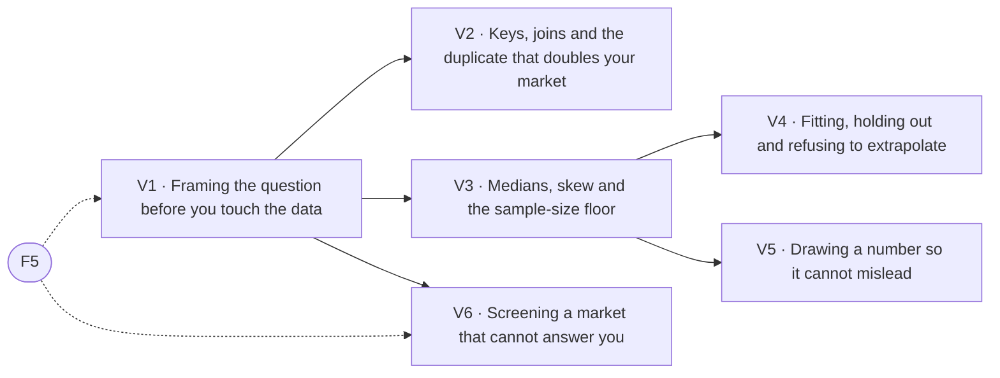

# Evidence, data & judgment

> Pillar 07 of 8 · **6 items** (6 courses, 0 guides) · **26 modules** · all 6 live

The pillar that keeps the platform honest. Framing before querying, keys and joins, medians and the sample-size floor, refusing to extrapolate, and drawing a number so it cannot mislead. Every rule here is enforced somewhere in the product.

Source of truth: [`curriculum/curriculum-50.csv`](../curriculum-50.csv) and [`curriculum/curriculum.py`](../curriculum.py). Status is derived by `status_of()`, never stored; [`validate.py`](../validate.py) gates every build on the eight checks. Edit the source, not this file — regenerate with `python3 curriculum/gen_courses.py`, as noted in [`README.md`](README.md).

## At a glance

| ID | Level | Title | Kind | Modules | Prerequisites |
|----|-------|-------|------|---------|---------------|
| **V1** | 2 | Framing the question before you touch the data | course | 4 | F5 |
| **V2** | 3 | Keys, joins and the duplicate that doubles your market | course | 4 | V1 |
| **V3** | 3 | Medians, skew and the sample-size floor | course | 4 | V1 |
| **V4** | 4 | Fitting, holding out and refusing to extrapolate | course | 4 | V3 |
| **V5** | 4 | Drawing a number so it cannot mislead | course | 4 | V3 |
| **V6** | 4 | Screening a market that cannot answer you | course | 6 | V1, F5 |

## Prerequisite flow

Dashed nodes are prerequisites from other pillars: **F5** (Reading Locator.X: score, evidence grade, coverage, Foundations & the Locator.X doctrine).

## Level 2 — Practitioner

*Working skills: the buy box, survival numbers, coverage, the relationship map in practice.*

### V1 — Framing the question before you touch the data

*Course · 4 modules · status: live*

**The promise.** The most expensive errors are correct answers to questions nobody needed.

**Take first:** **F5** (Reading Locator.X: score, evidence grade, coverage).

**Where it lands in the product:** Evidence & analysis e2; the per-signal coverage chart.

**Backing tracks:** `evidence`

## Level 3 — Operator

*Running deals: entitlement, feasibility, pro formas, the lender's triangle, hard conversations.*

### V2 — Keys, joins and the duplicate that doubles your market

*Course · 4 modules · status: live*

**The promise.** A key that is not unique will silently multiply your rows.

**Take first:** **V1** (Framing the question before you touch the data).

**Where it lands in the product:** Evidence & analysis e3.

**Backing tracks:** `evidence`

### V3 — Medians, skew and the sample-size floor

*Course · 4 modules · status: live*

**The promise.** On right-skewed price data the mean is a tail and the median is a market.

**Take first:** **V1** (Framing the question before you touch the data).

**Where it lands in the product:** Evidence & analysis e4; the Patterns panel's Wilson intervals.

**Backing tracks:** `evidence`

## Level 4 — Principal

*Structuring and judgment: waterfalls, capital markets, partnerships, the exit, the thesis.*

### V4 — Fitting, holding out and refusing to extrapolate

*Course · 4 modules · status: live*

**The promise.** Search on one deterministic half, measure on the other, cap what you compound.

**Take first:** **V3** (Medians, skew and the sample-size floor).

**Where it lands in the product:** Evidence & analysis e5; Predictions and Outlook.

**Backing tracks:** `evidence`

### V5 — Drawing a number so it cannot mislead

*Course · 4 modules · status: live*

**The promise.** A chart is an argument made in geometry.

**Take first:** **V3** (Medians, skew and the sample-size floor).

**Where it lands in the product:** Evidence & analysis e7; the validated palette.

**Backing tracks:** `evidence`

### V6 — Screening a market that cannot answer you

*Course · 6 modules · status: live*

**The promise.** Underwrite where the record is silent, without turning silence into a pass or a fail.

**Take first:** **V1** (Framing the question before you touch the data), **F5** (Reading Locator.X: score, evidence grade, coverage).

**Where it lands in the product:** Screening a market that cannot answer you nd1-nd6.

**Backing tracks:** `nondisc`
