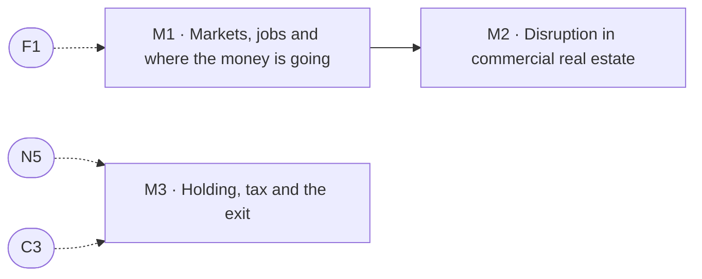

# Market, practice & the long game

> Pillar 08 of 8 · **3 items** (2 courses, 1 guides) · **12 modules** · all 3 live

From a jobs announcement to a rent, disruption in how space is used and priced, and the hold-tax-exit arithmetic that decides what you actually keep.

Source of truth: [`curriculum/curriculum.py`](../curriculum.py). [`curriculum-50.csv`](../curriculum-50.csv) is derived from it, and so is this page. Status is derived by `status_of()`, never stored; [`validate.py`](../validate.py) gates every build on the eight checks. Edit curriculum.py, not this file and not the CSV — regenerate with `python3 curriculum/gen_courses.py`, as noted in [`README.md`](README.md).

## At a glance

| ID | Level | Title | Kind | Modules | Prerequisites |
|----|-------|-------|------|---------|---------------|
| **M1** | 2 | Markets, jobs and where the money is going | course | 4 | F1 |
| **M2** | 4 | Disruption in commercial real estate | guide | 4 | M1 |
| **M3** | 4 | Holding, tax and the exit | course | 4 | N5, C3 |

## Prerequisite flow

Dashed nodes are prerequisites from other pillars: **C3** (The lender's triangle: LTV, DSCR and debt yield, Capital & structure), **F1** (How a building pays you, Foundations & the Locator.X doctrine), **N5** (Equity multiple, WACC and beating the money, The numbers).

## Level 2 — Practitioner

*Working skills: the buy box, survival numbers, coverage, the relationship map in practice.*

### M1 — Markets, jobs and where the money is going

*Course · 4 modules · status: live*

**The promise.** From an announcement to a rent, and how long that actually takes.

**Take first:** **F1** (How a building pays you).

**Where it lands in the product:** Markets m1-m3; the corporate projects layer.

**Backing tracks:** `mkt`

## Level 4 — Principal

*Structuring and judgment: waterfalls, capital markets, partnerships, the exit, the thesis.*

### M2 — Disruption in commercial real estate

*Guide · 4 modules · status: live*

**The promise.** What is actually changing in how space is used, financed and priced.

**Take first:** **M1** (Markets, jobs and where the money is going).

**Where it lands in the product:** Graduate g6 — climate risk in underwriting.

**Backing tracks:** `wider`

### M3 — Holding, tax and the exit

*Course · 4 modules · status: live*

**The promise.** Depreciation, recapture, and why the exit is priced by the next buyer's debt.

**Take first:** **N5** (Equity multiple, WACC and beating the money), **C3** (The lender's triangle: LTV, DSCR and debt yield).

**Where it lands in the product:** Holding, tax & exit t1-t2.

**Backing tracks:** `tax`
