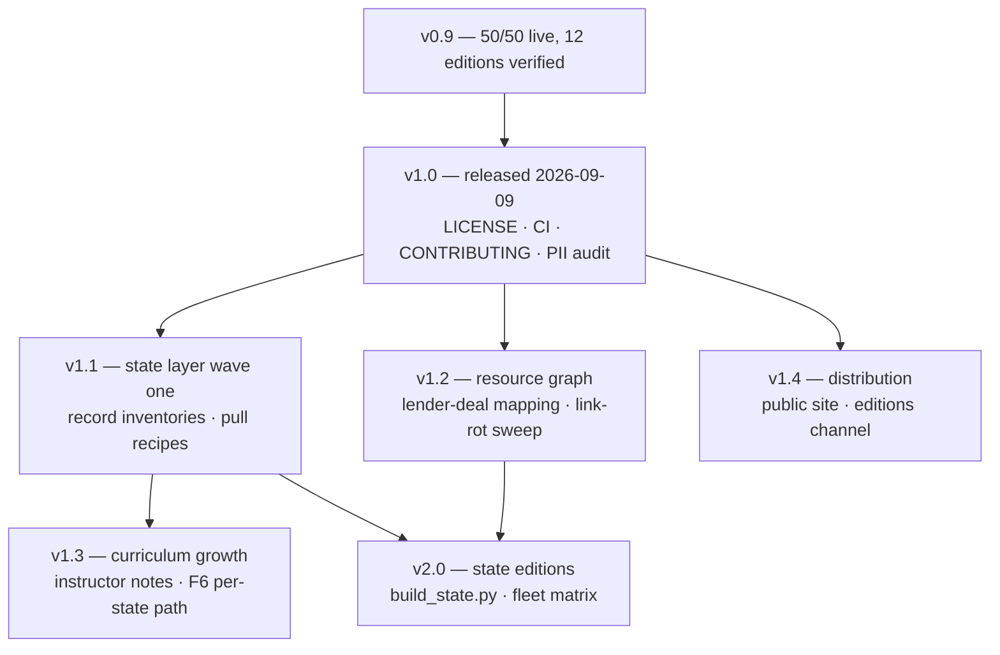

# Locator.X — Roadmap

A versioned, multi-section plan. Each numbered version is a coherent, shippable state of the
project; each workstream cuts across versions. The roadmap is governed by the project's one
rule — **measure before asserting** — so every milestone names the check that proves it shipped.

---

## Contents

1. [Versioning scheme](#1-versioning-scheme)
2. [Where we are — v1.0 released and public](#2-where-we-are--v10-released-and-public-the-distribution-layer-is-shipping)
3. [v1.0 — Public release](#3-v10--public-release)
4. [v1.1 — The state layer, wave one](#4-v11--the-state-layer-wave-one)
5. [v1.2 — The resource graph](#5-v12--the-resource-graph)
6. [v1.3 — Curriculum growth](#6-v13--curriculum-growth)
7. [v1.4 — Distribution: the public site and the editions channel](#7-v14--distribution-the-public-site-and-the-editions-channel)
8. [v2.0 — Multi-state editions at full depth](#8-v20--multi-state-editions-at-full-depth)
9. [Workstreams](#9-workstreams)
10. [Sequencing and dependencies](#10-sequencing-and-dependencies)
11. [Non-goals](#11-non-goals)
12. [How this roadmap is governed](#12-how-this-roadmap-is-governed)

---

## 1. Versioning scheme

- **Minor versions (1.1, 1.2, …)** add a layer — a documentation tier, a data wave, a
  curriculum expansion — without changing what existing editions promise.
- **Major versions (2.0)** change what an edition *is* (e.g. state editions at national depth).
- **The repository is the release unit.** Editions are build products and carry the repo's
  version; [`EDITIONS_MANIFEST.md`](EDITIONS_MANIFEST.md) records the per-edition lineage.
- History lives in [`../CHANGELOG.md`](../CHANGELOG.md).

## 2. Where we are — v1.0 released and public; the distribution layer is shipping

**v1.0 is cut and the repository is public.** All five release gates are closed (§3):
licence chosen (Apache-2.0 code / CC BY 4.0 content), attribution signed off, git history
audited clean of data blobs, CI gates running, CONTRIBUTING published. The tag is
`v1.0.0` (`529513d`, 2026-09-09), and GitHub reports the repository `public` with the
Apache-2.0 licence detected (checked 2026-09-11). The licence dependency everything
queued behind (§10) is discharged.

**Fifty-three commits have landed since the tag** (measured against `origin/main`,
2026-09-11). They are not a version boundary yet — §12 says the CHANGELOG records a
boundary when it is crossed, not when it is hoped for — but they are three layers, each
with its own check:

- **The whole app under CI.** `fleet-smoke.yml` builds the synthetic-fleet demo from
  source with no data tree and drives all eleven editions headless: zero page errors,
  per-edition title, fixture count and full version selector.
- **The public site.** `deploy-pages.yml` assembles `pages/` plus four layers generated
  at deploy time. Verified building in CI; publication is blocked on one repository
  setting (§7).
- **The measured market layer.** `market/` carries figures extracted from the shipped
  editions with their provenance, gated by `market/validate_market.py` (eight rules,
  raising) and rendered by `scripts/build_market_pages.py`.

Current work: v1.1 wave one (§4) and distribution (§7).

Shipped and verified at v0.9 (fleet sweep of 2026-09-09):

- 84 source modules, 33 builders, one shared build library.
- **Curriculum complete:** 50/50 items live, 19 tracks, 92 lessons; the eight-check validator
  gates every build.
- Twelve editions pass the Playwright sweep with zero page errors.
- Three markets at depth: national baseline, Bay Area premium, New Orleans + Baton Rouge value.
- Documentation layer: overview, per-pillar course catalogs, state-by-state process guides
  ([`states/`](states/README.md)), and the cross-referenced resource directory
  ([`resources/`](resources/README.md)).

**Gate to call it done:** `python3 curriculum/validate.py` green from a clean checkout — it is.

## 3. v1.0 — Public release

The smallest version that can be public without regret.

| Item | Why it blocks release | Proof it shipped |
|------|----------------------|------------------|
| ✅ `LICENSE` file | README states all rights reserved until the Foundation chooses; a public repo without a licence invites accidental infringement in both directions | Shipped: Apache-2.0 for code (`LICENSE` + `NOTICE`), CC BY 4.0 for written content (`LICENSE-docs`); README licence section updated |
| ✅ Attribution review | The no-affiliation notices must read exactly as intended before strangers quote them | Foundation confirmed the attribution and scope section as written, 2026-09-09 |
| ✅ `data/` stays ignored — audited | Upstream feeds carry owner PII; git history cannot be cleaned later | Audited at licence time: history holds only the stub and the documented source drops, no data blobs; ignore rules in place |
| ✅ CI: validator + link + catalog-sync checks on every push | The eight checks currently run locally; public contributions need the gate automated | `.github/workflows/validate.yml`: curriculum gate, generated-catalog drift check, internal link check |
| ✅ CONTRIBUTING.md | Contributors need the doctrine (measure before asserting; unknown is an answer) stated as rules, not folklore | File exists; doctrine as rules, pre-PR checklist, contribution licensing |

## 4. v1.1 — The state layer, wave one

Deepen the [state-by-state process](states/README.md) from guide to working layer, three states
at a time, starting where the data already is (Louisiana, California) plus one new state chosen
by data availability.

- Per-state **record inventories**: which of the seven LOCATOR gates the public record can
  actually answer in that state, county by county — the same honesty the Comps desk already
  applies to Orleans and EBR.
- Per-state pull recipes appended to [`PULL_RECIPE.md`](PULL_RECIPE.md) as feeds are verified.
- County program and lender entries in [`resources/state-county-programs.md`](resources/state-county-programs.md)
  cross-checked against the live state pages (programs change; the check date is recorded).

**Proof:** each wave state gets a "record coverage" table with a source and pull date for every
row — no row without a source.

*Status:* wave one **started** — [`states/coverage/`](states/coverage/README.md) holds the
inventories for Louisiana and California (anchor markets; shipped-feed rows cite the
editions and [`PULL_RECIPE.md`](PULL_RECIPE.md)) and Florida (the new wave state, chosen
for the DOR statewide NAL/SDF rolls). Wave one completes when every `named` row has a
recorded probe: advanced to `pulled`, or converted to `blocked`/`no public record` with
the reason dated. **Wave two opened early by Foundation direction (2026-09-09):**
Nebraska — Omaha, Lincoln, Sarpy and the smaller metros as asset-class expansion
candidates ([`states/coverage/nebraska.md`](states/coverage/nebraska.md)), feeding the
[asset-class layer](asset-classes/README.md). **Corridor states graduated (2026-09-10):**
the measured 2026-09-04/05 pulls for NC, OH, IN, UT, AZ, NM and NY are now per-state
coverage inventories with field-reliability verdicts — eleven states carry inventories
in [`states/coverage/`](states/coverage/README.md).

## 5. v1.2 — The resource graph

Turn the resource directory from lists into a cross-referenced graph:

- Every lender type in [`resources/lenders.md`](resources/lenders.md) linked to the deal shapes
  it actually underwrites (DSCR floors, LTV ceilings, minimum loan sizes) and to the curriculum
  courses that teach the underwriting ([C1–C7](../curriculum/courses/05-capital-structure.md)).
- Every federal program mapped to the state administrators that run it, state by state.
- A quarterly **link-rot sweep**: every URL the repository cites as a source checked;
  dead links fixed or removed, sweep date recorded in the file header.

**Proof:** the sweep script exits zero over a set that is measured, not assumed — the count
of URLs it collects from the sourced data files is asserted by `tests/run.py`, so the sweep
cannot pass by checking nothing.

*Status:* **complete, after a correction.** The sweep ships as
`scripts/check_external_links.py` (classifies ok / auth-gated / broken) with
`.github/workflows/link-rot.yml` running it quarterly on GitHub runners, where egress is
open.

> **Correction, 2026-09-11.** This milestone previously claimed the sweep checked "every
> URL in `docs/resources/` and `docs/states/`", proven by the script exiting zero.
> Measured: those directories contain **zero URLs** between them — 6 and 20 files
> respectively — because their rows cite agencies and statutes by name rather than by
> link. The sweep was exiting zero over nothing, which is a vacuous proof and exactly the
> certainty error this platform exists to catch. The repository's real per-row citations
> live in the sourced data files, and the sweep now walks those too: **361 URLs** from
> `market/` and `crosswalk/` (project announcements, campus enrolment sources, permit and
> population series) against 3 from markdown. Published artifact URLs are deliberately
> skipped — they are private to their owner, so an anonymous probe cannot tell "gone" from
> "not yours", and their integrity is established by the sha256 manifest instead.
> `tests/run.py` asserts the data-file citation count so the coverage cannot go vacuous
> again. The lender-deal mapping is the matching matrix in
[`resources/lenders.md` §9](resources/lenders.md#9-the-matching-matrix); the
program-administrator mapping is
[`resources/state-administrators.md`](resources/state-administrators.md) (LIHTC
allocator + SHPO + state credit per state, routing patterns for the rest).

## 6. v1.3 — Curriculum growth

The catalog is complete at 50; growth means depth, not count inflation:

- **Instructor notes** — the layer exists (`check 8` validates anchors) and deliberately
  renders nothing until notes are supplied. Fill the first tier: one note per Level-1 course.

  *Status:* the paved road is built — [`curriculum/INSTRUCTOR_NOTES.md`](../curriculum/INSTRUCTOR_NOTES.md)
  documents the schema, the validated anchor vocabulary, the supply workflow (including
  the README expected-output update), and a ten-item Level-1 worksheet of prompts. The
  words themselves are the platform owner's to write — the layer's founding rule.
- **The 90-day path (F6)** upgraded with per-state checkpoints once wave-one states land —
  the written offer at day 90 looks different in a judicial-foreclosure lien state than in a
  nonjudicial deed state.

  *Status:* the docs-side companion is shipped —
  [`states/ninety-day-path.md`](states/ninety-day-path.md) localizes all three F6 phases
  against the state guides (phase names taken from the in-app guide's §9), with four
  state archetypes. In-app per-state checkpoint content follows the instructor-notes
  supply workflow once wave states reach `pulled`.
- Case-study additions to the record layer, each claim still marked documented / reported /
  disputed.

  *Status:* the first candidate is drafted docs-side under the record discipline —
  [`cases/wework-lease-duration.md`](cases/wework-lease-duration.md) (the duration
  mismatch, 2019 S-1 → 2023 chapter 11 → 2024 emergence; eight marked claims, sources
  verified 2026-09-10, a measurement note separating the three circulating figures).
  Porting into the in-app record track changes lesson counts and follows the module
  supply workflow.

**Proof:** validator check 8 goes from "none supplied yet" to a counted, non-zero note set with
zero unresolved anchors.

## 7. v1.4 — Distribution: the public site and the editions channel

The layer that puts the work in front of someone who has not cloned the repository.
Everything here is generated at deploy time and never committed, so a published page
cannot drift from the source it claims to render — the same rule the curriculum catalogs
follow.

| Item | Why it matters | Proof it shipped |
|------|----------------|------------------|
| ✅ The app, runnable with no data tree | An edition is 5–15 MB of county records; a visitor cannot be asked to build one to see the tool | `scripts/build_fleet_demo.py` generates the 84-module shell over deterministic synthetic fixtures (~11,500 records on a fictional island, labelled in a fixed banner) — 1.59 MB built in CI; `fleet-smoke.yml` drives all eleven editions green |
| ✅ The real record layer, published | The crosswalk is the platform's most checkable claim and lived only in a JSON file | `scripts/build_crosswalk_page.py` renders 8 jurisdictions, 48 codes (44 measured, 4 flagged unverified), 12,339 parcels — built in CI on every deploy |
| ✅ The measured market layer | The market figures were hand-committed HTML nobody could rebuild | `market/` + `scripts/build_market_pages.py` render seven pages; `market/validate_market.py` gates the data and `tests/run.py` renders the set and proves the unknown-handling path on a synthetic tree |
| ✅ The editions channel | Built editions may never enter this repository, but they still have to reach the site | `scripts/publish_editions.sh` → companion repo → `scripts/build_editions_index.py`, which verifies every file against its manifest sha256 before it may appear and refuses a mismatch by name; renders an honest empty state when nothing is published |
| ⬜ The site actually published | Everything above is built and discarded until Pages is on | **Blocked, measured:** the GitHub API reports `has_pages: false` (2026-09-11) and `configure-pages` fails every run with "Resource not accessible by integration" — a token cannot create the Pages site. Unblocks with one repository setting: Settings → Pages → Source: "GitHub Actions" |
| ⬜ The real editions live on the site | The channel is loaded but has nothing to read | **Blocked, measured:** `AGIFutureFoundation/Locator.X-editions` does not exist and this session's credential cannot create repositories (403). The twelve editions are staged and hash-verified (12 live, 0 refused) with their sha256 table in [`PUBLISH_MAP.md`](PUBLISH_MAP.md); they remain live at their individual artifact URLs meanwhile |

**Proof of the version:** the site deploys, `/editions/` lists the published set with every
file's hash verified, and the landing page's links all resolve.

*Status:* everything buildable is built and green in CI; both open items are repository
settings held by the Foundation, not code. Stated as blockers with the measurement that
establishes each, per §12's rule that the roadmap says *unknown* and names the probe
rather than inventing a date.

## 7b. v1.5 — The transaction layer, and a set that can leave

Two layers that turn a screen into work a reader can take somewhere.

| Item | Why it matters | Proof it shipped |
|------|----------------|------------------|
| ✅ The closing file, assembled from the record | The due-diligence checklist was twelve hardcoded San Francisco strings shipped in every edition — it asked a Louisiana buyer for an SF 3R report — and the offer draft printed `CA` into every address everywhere | `content/closing_packet.json` → `scripts/build_packet.py` → [`CLOSING_PACKET.md`](CLOSING_PACKET.md) + `src/packet.js`: 12 clause families as questions for counsel, 24 document requests filtered by asset class (hotel 21 items, single-family 13), state facts parsed from the guides that carry their sources. Four guards, each proven by breaking what it protects |
| ✅ The stress block | Screening numbers say how a deal looks; nothing said where it stops working | `src/underwrite.js`: break-even rent and cushion, break-even rate and headroom, the loan this NOI supports at DSCR 1.25, and DSCR under +200 bp / rent −10% / vacancy +5 pts / all three. Arithmetic over the existing stack; unknown inputs stay unknown |
| ✅ The geospatial interchange | A screened set could not reach QGIS, ArcGIS, a Mapbox tileset or anyone else's map | `src/geoexport.js` writes RFC 7946 GeoJSON and matching CSV; every feature carries `lx:price_basis` and `lx:geometry_basis` so an index estimate cannot be read as a price and a ZIP centroid cannot be read as a parcel. Contract in [`INTEROP.md`](INTEROP.md); locked by `tests/fleet_smoke.js` |
| ⬜ Import of a foreign GeoJSON | The interchange is one-way out | Not started. Reading someone else's file means deciding what its provenance claims are worth, which is a doctrine question before it is a parsing one |

**Proof of the version:** a reader can screen a set, export it as geography without
laundering a number, and walk into an attorney's office with the file the course taught
them to assemble.

## 8. v2.0 — Multi-state editions at full depth

The version boundary where an edition changes meaning: from "three markets plus thematic
screens" to "any wave state at national-baseline depth".

- A state edition template builder (`build_state.py`) parameterised the way
  `build_atlas_*.py` already is.

  *Status:* shipped as a spec-driven builder with `--dry-run` verification (every
  regionalization pair checked against current source; a stale pair fails loudly). All
  eleven shipped editions are transcribed as specs (2026-09-10), pair-for-pair from
  their hand builders; `tests/run.py` holds builder and spec in lockstep by AST
  comparison, and `scripts/check_pairs.py` checks every hand builder's pairs
  sequentially (its first two runs found and removed thirty-one dead or shadowed
  replacements — eighteen dead finds, then thirteen more once the check became
  order-aware, including four editions whose intended dashboard eyebrow had never
  shipped). The originals remain canonical until a fleet sweep verifies byte-parity;
  on parity they retire.
- The evidence ceiling honestly enforced per state — a state whose record cannot support the
  conversion engine ships without it, and the edition says so.
- The fleet sweep extended to every state edition; the 19-track / 92-lesson assertion holds in
  each.

**Proof:** the sweep matrix — every edition × every assertion — green, published in the
manifest.

## 9. Workstreams

Seven standing workstreams cut across the versions:

| Workstream | Owner-of-record artifact | Version focus |
|------------|--------------------------|---------------|
| **Platform** (app modules, build) | `src/`, `lxbuild.py` | 1.0 CI → 2.0 state template |
| **Data** (pulls, packing, PII) | [`PULL_RECIPE.md`](PULL_RECIPE.md), `data/README.md` | 1.1 wave feeds → 2.0 depth |
| **Curriculum** (Academy) | `curriculum/` | 1.3 instructor notes |
| **States & programs** | [`states/`](states/README.md) | 1.1 waves → 1.2 cross-checks |
| **Resources** | [`resources/`](resources/README.md) | 1.2 graph + link-rot sweeps |
| **Release & community** | README, CONTRIBUTING, CHANGELOG | 1.0 licence, CI, sign-off |
| **Distribution** (the public site, the editions channel) | `pages/`, `market/`, `scripts/build_*_page*.py`, `.github/workflows/deploy-pages.yml` | 1.4 site + channel |

## 10. Sequencing and dependencies

**The licence decision — the one hard external dependency everything public queued behind —
is discharged** (Apache-2.0 / CC BY 4.0, chosen and signed off 2026-09-09; the repository has
been public since). Two external dependencies remain, both repository settings held by the
Foundation rather than code, and both are recorded in §7 with the measurement that establishes
them: GitHub Pages is not enabled (`has_pages: false`, 2026-09-11), and the editions companion
repository does not exist yet. Neither blocks any other workstream — the site and the channel
build and verify in CI regardless; they simply are not served until those switches flip.

## 11. Non-goals

Stated so they do not creep back in:

- **No server, no accounts, no tracking.** The single-file, network-off property is the
  product.
- **No committed data mirrors** — PII history cannot be cleaned; this is settled.
- **No course-count inflation.** 50 items is the catalog; depth grows, the number does not
  (a change here is a doctrine change, not a backlog item).
- **No advice.** Nothing in scope makes the platform legal, tax, securities or investment
  advice; the state and resource layers are navigation aids to the public record, not
  recommendations.

## 12. How this roadmap is governed

- Every milestone ships with its **proof** — the measurable check named in its table. A
  milestone without a check is not on the roadmap; it is a wish.
- The certainty-error rule applies to planning too: where we do not know (a state's record
  quality, a feed's licensing), the roadmap says **unknown** and names the probe that will
  answer it, instead of a date.
- This file is amended by PR like any other source file, and the CHANGELOG records when a
  version boundary is actually crossed — not when it was hoped for.
