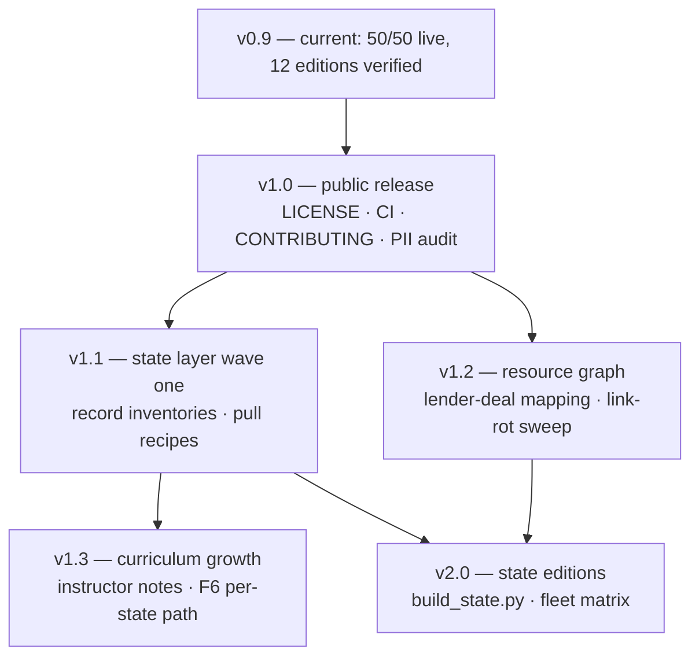

# Locator.X — Roadmap

A versioned, multi-section plan. Each numbered version is a coherent, shippable state of the
project; each workstream cuts across versions. The roadmap is governed by the project's one
rule — **measure before asserting** — so every milestone names the check that proves it shipped.

---

## Contents

1. [Versioning scheme](#1-versioning-scheme)
2. [Where we are — v1.0](#2-where-we-are--v10)
3. [v1.0 — Public release](#3-v10--public-release)
4. [v1.1 — The state layer, wave one](#4-v11--the-state-layer-wave-one)
5. [v1.2 — The resource graph](#5-v12--the-resource-graph)
6. [v1.3 — Curriculum growth](#6-v13--curriculum-growth)
7. [v2.0 — Multi-state editions at full depth](#7-v20--multi-state-editions-at-full-depth)
8. [Workstreams](#8-workstreams)
9. [Sequencing and dependencies](#9-sequencing-and-dependencies)
10. [Non-goals](#10-non-goals)
11. [How this roadmap is governed](#11-how-this-roadmap-is-governed)

---

## 1. Versioning scheme

- **Minor versions (1.1, 1.2, …)** add a layer — a documentation tier, a data wave, a
  curriculum expansion — without changing what existing editions promise.
- **Major versions (2.0)** change what an edition *is* (e.g. state editions at national depth).
- **The repository is the release unit.** Editions are build products and carry the repo's
  version; [`EDITIONS_MANIFEST.md`](EDITIONS_MANIFEST.md) records the per-edition lineage.
- History lives in [`../CHANGELOG.md`](../CHANGELOG.md).

## 2. Where we are — v1.0

**All five v1.0 gates are closed** (§3): licence chosen (Apache-2.0 code / CC BY 4.0
content), attribution signed off by the Foundation, git history audited clean of data
blobs, CI running the validator + drift + link gates, CONTRIBUTING published. The
repository is release-ready; flipping it public is a Foundation switch, not a code change.
Current work is v1.1 wave one (§4).

Shipped and verified at v0.9 (fleet sweep of 2026-09-09):

- 84 source modules, 33 builders, one shared build library.
- **Curriculum complete:** 50/50 items live, 19 tracks, 92 lessons; the eight-check validator
  gates every build.
- Twelve editions pass the Playwright sweep with zero page errors.
- Three markets at depth: national baseline, Bay Area premium, New Orleans + Baton Rouge value.
- Documentation layer: overview, per-pillar course catalogs, state-by-state process guides
  ([`states/`](states/README.md)), and the cross-referenced resource directory
  ([`resources/`](resources/README.md)).

**Gate to call it done:** `python3 curriculum/validate.py` green from a clean checkout — it is.

## 3. v1.0 — Public release

The smallest version that can be public without regret.

| Item | Why it blocks release | Proof it shipped |
|------|----------------------|------------------|
| ✅ `LICENSE` file | README states all rights reserved until the Foundation chooses; a public repo without a licence invites accidental infringement in both directions | Shipped: Apache-2.0 for code (`LICENSE` + `NOTICE`), CC BY 4.0 for written content (`LICENSE-docs`); README licence section updated |
| ✅ Attribution review | The no-affiliation notices must read exactly as intended before strangers quote them | Foundation confirmed the attribution and scope section as written, 2026-09-09 |
| ✅ `data/` stays ignored — audited | Upstream feeds carry owner PII; git history cannot be cleaned later | Audited at licence time: history holds only the stub and the documented source drops, no data blobs; ignore rules in place |
| ✅ CI: validator + link + catalog-sync checks on every push | The eight checks currently run locally; public contributions need the gate automated | `.github/workflows/validate.yml`: curriculum gate, generated-catalog drift check, internal link check |
| ✅ CONTRIBUTING.md | Contributors need the doctrine (measure before asserting; unknown is an answer) stated as rules, not folklore | File exists; doctrine as rules, pre-PR checklist, contribution licensing |

## 4. v1.1 — The state layer, wave one

Deepen the [state-by-state process](states/README.md) from guide to working layer, three states
at a time, starting where the data already is (Louisiana, California) plus one new state chosen
by data availability.

- Per-state **record inventories**: which of the seven LOCATOR gates the public record can
  actually answer in that state, county by county — the same honesty the Comps desk already
  applies to Orleans and EBR.
- Per-state pull recipes appended to [`PULL_RECIPE.md`](PULL_RECIPE.md) as feeds are verified.
- County program and lender entries in [`resources/state-county-programs.md`](resources/state-county-programs.md)
  cross-checked against the live state pages (programs change; the check date is recorded).

**Proof:** each wave state gets a "record coverage" table with a source and pull date for every
row — no row without a source.

*Status:* wave one **started** — [`states/coverage/`](states/coverage/README.md) holds the
inventories for Louisiana and California (anchor markets; shipped-feed rows cite the
editions and [`PULL_RECIPE.md`](PULL_RECIPE.md)) and Florida (the new wave state, chosen
for the DOR statewide NAL/SDF rolls). Wave one completes when every `named` row has a
recorded probe: advanced to `pulled`, or converted to `blocked`/`no public record` with
the reason dated. **Wave two opened early by Foundation direction (2026-09-09):**
Nebraska — Omaha, Lincoln, Sarpy and the smaller metros as asset-class expansion
candidates ([`states/coverage/nebraska.md`](states/coverage/nebraska.md)), feeding the
[asset-class layer](asset-classes/README.md). **Corridor states graduated (2026-09-10):**
the measured 2026-09-04/05 pulls for NC, OH, IN, UT, AZ, NM and NY are now per-state
coverage inventories with field-reliability verdicts — eleven states carry inventories
in [`states/coverage/`](states/coverage/README.md).

## 5. v1.2 — The resource graph

Turn the resource directory from lists into a cross-referenced graph:

- Every lender type in [`resources/lenders.md`](resources/lenders.md) linked to the deal shapes
  it actually underwrites (DSCR floors, LTV ceilings, minimum loan sizes) and to the curriculum
  courses that teach the underwriting ([C1–C7](../curriculum/courses/05-capital-structure.md)).
- Every federal program mapped to the state administrators that run it, state by state.
- A quarterly **link-rot sweep**: every URL in `docs/resources/` and `docs/states/` checked;
  dead links fixed or removed, sweep date recorded in the file header.

**Proof:** the sweep script exits zero; each resource file carries its last-verified date.

*Status:* **complete.** The sweep ships as `scripts/check_external_links.py` (classifies
ok / auth-gated / broken) with `.github/workflows/link-rot.yml` running it quarterly on
GitHub runners, where egress is open. The lender-deal mapping is the matching matrix in
[`resources/lenders.md` §9](resources/lenders.md#9-the-matching-matrix); the
program-administrator mapping is
[`resources/state-administrators.md`](resources/state-administrators.md) (LIHTC
allocator + SHPO + state credit per state, routing patterns for the rest).

## 6. v1.3 — Curriculum growth

The catalog is complete at 50; growth means depth, not count inflation:

- **Instructor notes** — the layer exists (`check 8` validates anchors) and deliberately
  renders nothing until notes are supplied. Fill the first tier: one note per Level-1 course.

  *Status:* the paved road is built — [`curriculum/INSTRUCTOR_NOTES.md`](../curriculum/INSTRUCTOR_NOTES.md)
  documents the schema, the validated anchor vocabulary, the supply workflow (including
  the README expected-output update), and a ten-item Level-1 worksheet of prompts. The
  words themselves are the platform owner's to write — the layer's founding rule.
- **The 90-day path (F6)** upgraded with per-state checkpoints once wave-one states land —
  the written offer at day 90 looks different in a judicial-foreclosure lien state than in a
  nonjudicial deed state.

  *Status:* the docs-side companion is shipped —
  [`states/ninety-day-path.md`](states/ninety-day-path.md) localizes all three F6 phases
  against the state guides (phase names taken from the in-app guide's §9), with four
  state archetypes. In-app per-state checkpoint content follows the instructor-notes
  supply workflow once wave states reach `pulled`.
- Case-study additions to the record layer, each claim still marked documented / reported /
  disputed.

**Proof:** validator check 8 goes from "none supplied yet" to a counted, non-zero note set with
zero unresolved anchors.

## 7. v2.0 — Multi-state editions at full depth

The version boundary where an edition changes meaning: from "three markets plus thematic
screens" to "any wave state at national-baseline depth".

- A state edition template builder (`build_state.py`) parameterised the way
  `build_atlas_*.py` already is.

  *Status:* shipped as a spec-driven builder with `--dry-run` verification (every
  regionalization pair checked against current source; a stale pair fails loudly). The
  `nola`/`bay` specs are transcribed for parity; the originals remain canonical until a
  fleet sweep verifies byte-parity. The dry run's first run found three stale pairs in
  the original builders (tracked as a separate content-fix task).
- The evidence ceiling honestly enforced per state — a state whose record cannot support the
  conversion engine ships without it, and the edition says so.
- The fleet sweep extended to every state edition; the 19-track / 92-lesson assertion holds in
  each.

**Proof:** the sweep matrix — every edition × every assertion — green, published in the
manifest.

## 8. Workstreams

Six standing workstreams cut across the versions:

| Workstream | Owner-of-record artifact | Version focus |
|------------|--------------------------|---------------|
| **Platform** (app modules, build) | `src/`, `lxbuild.py` | 1.0 CI → 2.0 state template |
| **Data** (pulls, packing, PII) | [`PULL_RECIPE.md`](PULL_RECIPE.md), `data/README.md` | 1.1 wave feeds → 2.0 depth |
| **Curriculum** (Academy) | `curriculum/` | 1.3 instructor notes |
| **States & programs** | [`states/`](states/README.md) | 1.1 waves → 1.2 cross-checks |
| **Resources** | [`resources/`](resources/README.md) | 1.2 graph + link-rot sweeps |
| **Release & community** | README, CONTRIBUTING, CHANGELOG | 1.0 licence, CI, sign-off |

## 9. Sequencing and dependencies

The licence decision is the only hard external dependency: it belongs to the Foundation and
everything public queues behind it.

## 10. Non-goals

Stated so they do not creep back in:

- **No server, no accounts, no tracking.** The single-file, network-off property is the
  product.
- **No committed data mirrors** — PII history cannot be cleaned; this is settled.
- **No course-count inflation.** 50 items is the catalog; depth grows, the number does not
  (a change here is a doctrine change, not a backlog item).
- **No advice.** Nothing in scope makes the platform legal, tax, securities or investment
  advice; the state and resource layers are navigation aids to the public record, not
  recommendations.

## 11. How this roadmap is governed

- Every milestone ships with its **proof** — the measurable check named in its table. A
  milestone without a check is not on the roadmap; it is a wish.
- The certainty-error rule applies to planning too: where we do not know (a state's record
  quality, a feed's licensing), the roadmap says **unknown** and names the probe that will
  answer it, instead of a date.
- This file is amended by PR like any other source file, and the CHANGELOG records when a
  version boundary is actually crossed — not when it was hoped for.
