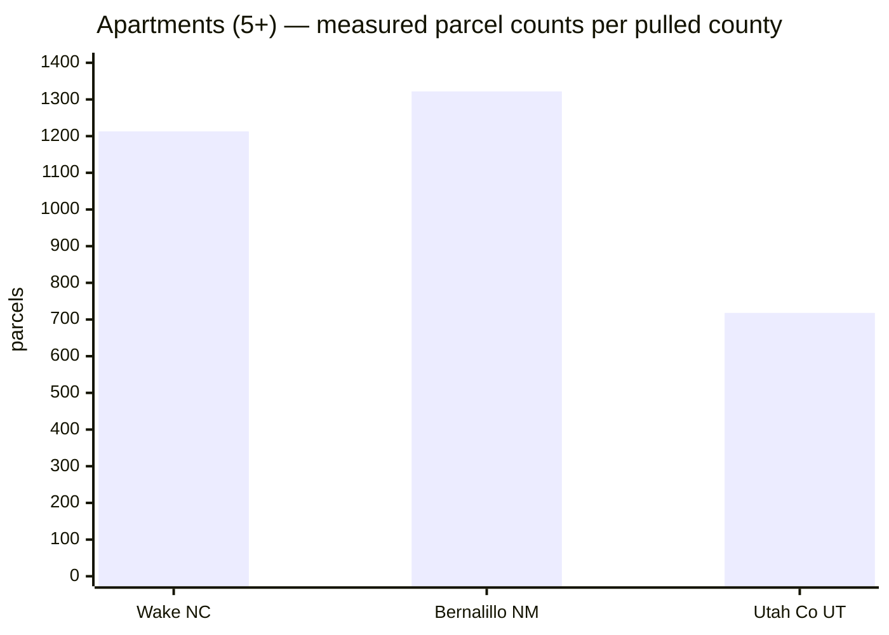
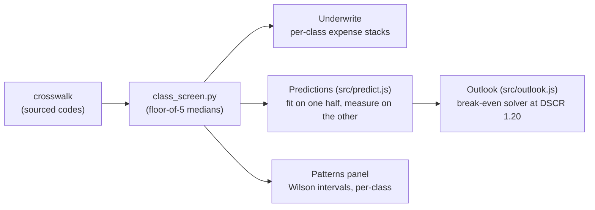
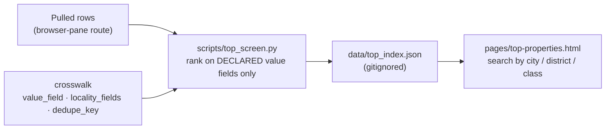

# The asset-class layer — hotels, apartments, 5+ multifamily

Building out new properties and regions **that match the Locator.X criteria** starts with a
problem the pull recipe documents on every page: no two counties call an apartment the same
thing. Wake says `GRDN APT`, Bernalillo says `LOW RISE APARTMENTS O4U (TO 3 STY)`, Ohio says
`401`, Florida will say `003`. A screen that guesses across those vocabularies ships
certainty errors at scale — so the class layer is built the platform's way: a **sourced,
dated crosswalk**, a **screening tool that enforces the evidence rules**, and a region
matrix built only from **measured counts**.

## The three pieces

| Piece | What it does |
|-------|--------------|
| [`crosswalk/usecodes.json`](../../crosswalk/usecodes.json) | Per-jurisdiction use-code vocabularies mapped to six screening classes — every code carries its source and verified date, or an explicit `null` (transcribed from a manual, not yet measured). Gated by [`crosswalk/validate_usecodes.py`](../../crosswalk/validate_usecodes.py) in CI. |
| [`scripts/class_screen.py`](../../scripts/class_screen.py) | Screens any pulled dataset by class with the doctrine in code: sample floor of 5 before any median, medians not means, unmatched codes counted and listed (never silently dropped), unverified vocabularies warned on every run. |
| This matrix | Which regions can even *identify* each class — the precondition for expansion, from the documented pulls. |

## The classes and their criteria

Tied to the curriculum's asset pillar ([A2 — the five classes are five businesses;
A7 — conversion stock](../../curriculum/courses/04-the-asset.md)):

- **`lodging`** — hotels, motels, resorts, B&Bs. Shortest lease in real estate (a night),
  so revenue reprices daily: underwrite RevPAR volatility, not a rent roll.
- **`apartments_5plus`** — purpose-built rental, 5+ units: agency-multifamily territory
  ([lenders §3](../resources/lenders.md#3-agency-and-government-multifamily)).
- **`small_multifamily_2_4`** — the 1-4-unit financing world with rental economics.
- **`student_housing`** — the campus-ring lens the `launi` edition is built on.
- **`mobile_home_park`** — pad-rental economics, its own lender set.
- **`mixed_residential`** — store/apt, office/apt, residential conversions: the
  conversion engine's candidate pool.

## The region matrix — measured, not assumed

Every number below is a parcel count returned by a live groupBy during the documented
pulls ([`PULL_RECIPE.md`](../PULL_RECIPE.md), 2026-09-04/05). A dash means the class is
not identifiable in that jurisdiction's vocabulary (which is a finding, not a gap to
paper over).

| Jurisdiction | apartments 5+ | small MF 2-4 | lodging | student | MHP | mixed |
|---|---|---|---|---|---|---|
| Wake, NC | 1,213¹ | 3,125 | 164 | — | — | 359 |
| Bernalillo, NM | 1,322 | 4,211 | 162 | — | 228 | — |
| Utah County, UT | 718 | — | 126 | 114 | 57 | 37 |
| Maricopa, AZ | (band pulled) | — | 503 resorts + hotels/motels² | — | — | — |
| Onondaga, NY | identifiable (plain-English) | — | — | identifiable | — | — |
| Guilford, NC | identifiable (`APART`) | — | — | — | — | — |
| Ohio (Franklin/Mahoning) | 401-403³ | — | 410/411 | — | 415 | 419 |
| Florida (all 67 counties) | 003⁴ | 008⁴ | 039⁴ | — | 028⁴ | — |

¹ GRDN 829 + ELEV 281 + THSE 70 + MUTFAM 33. ² Resorts measured at 503 parcels including
the band's single highest value ($280M); hotel/motel classes verified but not counted in
the log. ³ Code families verified; 401 spans 4-19 units so the 5+ screen needs the unit
count too. ⁴ Transcribed from the DOR manual, **unverified** until the NAL probe runs —
`class_screen.py` warns on every Florida run until then.

The negative findings matter as much: **Sandoval, NM** has *no usable use class at all*
(no apartment can be identified — the state layer's fields are empty), **Trumbull, OH**
is unreachable entirely, and Guilford's only unit-count field is a complex-level trap.
Those regions cannot enter a class screen honestly until their record improves, whatever
their market story says.

## What "matches the Locator.X criteria" means for a new region

A region qualifies for class build-out when, in order:

1. **The class is identifiable** — its vocabulary is in the crosswalk with measured
   counts (rows above), or one probe pull away.
2. **The value evidence supports a verdict** — enough valued parcels per class to clear
   the sample floor of 5, and disclosure status known (Bernalillo's apartments are
   identifiable but priced on assessments only — the evidence grade says so).
3. **The survival numbers are computable** — tax line recomputable at purchase, quoted
   insurance where coastal ([state guides](../states/README.md)), and unit counts from a
   field the pull recipe has verified as a *dwelling* count (Wake's TOTUNITS and Utah's
   LODGING counts are documented traps).
4. **The pipeline exists** — the state's distress mechanics are in the
   [quick reference](../states/README.md#the-50-state-quick-reference).

By that test, the measured shortlist today: **Wake** and **Bernalillo** for apartments
(Bernalillo with the non-disclosure caveat priced in), **Utah County** for the
student-housing lens next to `launi`'s Louisiana ring, **Maricopa** for lodging at the
resort end, and **Florida statewide** the moment the NAL probe verifies the code
dictionary — one probe unlocks 67 counties at once.

## How prediction and charts consume this

The predictive layer inherits the classes, not the other way around:

- Class medians feed comps context **only** where the class clears the floor and the
  state discloses prices — elsewhere the evidence grade caps what the chart may claim
  ([V3, V5](../../curriculum/courses/07-evidence-data-judgment.md)).
- Per-class prediction follows [V4](../../curriculum/courses/07-evidence-data-judgment.md):
  fit on one deterministic half, measure on the other, cap what compounds. A class below
  the floor gets **no model**, and the panel says so rather than extrapolating.
- Lodging never borrows an apartment cap rate: the classes exist precisely because the
  five businesses price differently (A2's whole argument).

## The top-properties pipeline

The "find the top properties" goal, as machinery (all of it runs only on real pulls):

- The crosswalk now declares, **only where measured or documented**, each jurisdiction's
  `value_field` (what a rank may honestly sort on — an assessment, never called a price),
  `locality_fields` (the city/district search facets) and `dedupe_key` (the measured
  multi-polygon collapse). A jurisdiction without a declared value field is counted but
  **unranked, with the reason printed** — unknown is an answer.
- `top_screen.py` merges any number of pulled jurisdictions into one national index:
  top-N per (jurisdiction × class), a national top-N per class, city/district facets,
  zero-value rows excluded and counted (Wake's condo shells are shells, not bargains),
  unverified vocabularies flagged on every run.
- `pages/top-properties.html` is the searchable front end — it bundles no data by design
  and loads a locally built index; the evidence notes panel carries each jurisdiction's
  ranking note and caveats next to the numbers.

## Growing the layer

1. Run a probe pull in the target county (browser-pane route, `PULL_RECIPE.md`).
2. Add the vocabulary to the crosswalk **from the groupBy result**, with counts and the
   date — `validate_usecodes.py` gates the entry.
3. Run `class_screen.py`; its *unmatched codes* list is the queue of codes to research
   against the county's published manual (never mapped by guess).
4. Record the traps in the pull recipe's additions log — the negative findings are the
   valuable ones.
