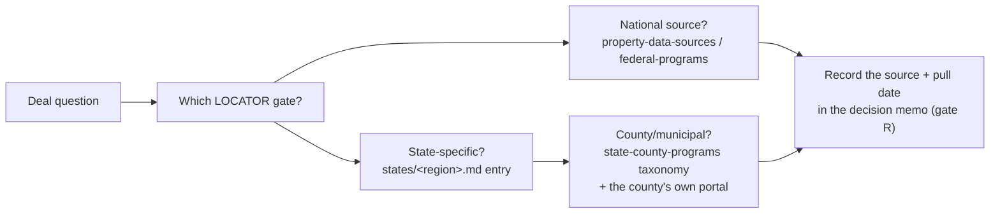

# The resource directory

The layer that keeps growing: property data sources, the lender landscape, federal programs,
and the state/county program taxonomy — cross-referenced against the
[state-by-state guides](../states/README.md) and the
[curriculum](../../curriculum/courses/README.md), so a resource is never just a link but a
node with edges: *what it answers, which LOCATOR gate it feeds, which course teaches its use,
which states it applies in.*

> **Verify before relying.** Programs open and close, portals move, lenders change credit
> boxes quarterly. Names here identify categories and long-standing institutions, not
> endorsements; nothing is legal, tax, securities or investment advice. Last reviewed:
> 2026-09. The [roadmap's v1.2](../ROADMAP.md#5-v12--the-resource-graph) adds a quarterly
> link-rot sweep with recorded verification dates.

## The four files

| File | What it holds | Feeds gates |
|------|---------------|-------------|
| [`property-data-sources.md`](property-data-sources.md) | Listing portals, public-record and bulk data, distress/auction channels, commercial data vendors | L, O, C, A |
| [`lenders.md`](lenders.md) | The lender landscape by type — what each underwrites to, and how to match a deal to money | T |
| [`federal-programs.md`](federal-programs.md) | FHA/HUD, agency, USDA, SBA, tax-credit and zone programs — the national layer every state administers | T, O |
| [`state-county-programs.md`](state-county-programs.md) | The taxonomy of state/county/municipal programs and exactly how to find each type in any jurisdiction | T, O, A |

## How the cross-reference works

Every deal question routes the same way:

1. **Start at the gate**, not the website. The [state process guide](../states/README.md)
   says which office answers each gate in that state.
2. **National layers first** — they are uniform and cheap to check (federal programs, listing
   portals, agency lender boxes).
3. **Then the state entry** — foreclosure/tax-sale mechanics, HFA, statewide portals.
4. **Then the county taxonomy** — [`state-county-programs.md`](state-county-programs.md)
   tells you what *kinds* of program exist at that level and the search pattern that finds
   each, because no directory of 3,000+ counties stays current.
5. **Write the source and pull date into the memo.** A row without a source is a certainty
   error waiting to be graded.

## Keeping it a deep resource, not a link farm

Rules for additions (PRs welcome once the repo is public):

- Every entry states **what question it answers** and **its failure mode** (coverage gaps,
  paywalls, lag, bias) — a source whose weakness you cannot name is a source you have not
  used.
- Prefer **categories with search patterns** over exhaustive lists that rot: "every county
  treasurer publishes a delinquency list; search `<county> treasurer tax sale`" outlives any
  3,000-row table.
- State-specific facts live in the [state guides](../states/README.md), not here — this
  directory holds the national layer and the taxonomy; the guides hold the local truth.
- Each file carries a *last reviewed* date at the top; the v1.2 sweep enforces it.
