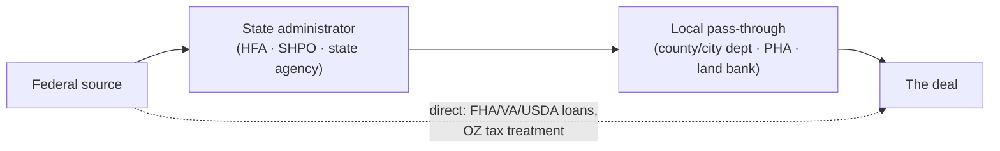

# Federal programs

*Last reviewed: 2026-09. The national layer every state administers its own way — the
state-side administrators are in the [state guides](../states/README.md) and the taxonomy in
[`state-county-programs.md`](state-county-programs.md). Program terms change with
appropriations and rulemaking; verify current guidance before underwriting any of it.*

---

## Contents

1. [Buying and occupying (1–4 units)](#1-buying-and-occupying)
2. [Multifamily finance](#2-multifamily-finance)
3. [The tax-credit stack](#3-the-tax-credit-stack)
4. [Place-based programs](#4-place-based-programs)
5. [Rural and small-city programs](#5-rural-and-small-city-programs)
6. [Preservation, environment and energy](#6-preservation-environment-and-energy)
7. [Block grants that become local programs](#7-block-grants-that-become-local-programs)
8. [How federal money reaches a deal](#8-how-federal-money-reaches-a-deal)

---

## 1. Buying and occupying

| Program | What it does | The catch |
|---------|--------------|-----------|
| FHA 203(b) | Low-down owner-occupied 1–4; the house-hack channel | Occupancy rules; MIP |
| FHA 203(k) | Purchase + rehab in one loan (limited and standard tiers) | Consultant process; contractor discipline |
| VA loan | ~0-down for eligible veterans; **assumable** | Entitlement math; occupancy |
| USDA 502 (guaranteed + direct) | ~0-down in eligible rural areas | Income caps; the map decides |
| HUD Good Neighbor Next Door | 50% discount for teachers/officers/EMT in revitalization areas | Thin inventory; occupancy term |
| HUD Home Store / FHA REO | Discounted FHA foreclosures, owner-occupant priority windows | As-is condition |
| Section 8 HCV homeownership | Vouchers applied to ownership in participating PHAs | PHA-by-PHA adoption |

Assumability (FHA/VA/USDA) is a federal fact with state-sized exit consequences — a
low-coupon assumable note changes gate O arithmetic anywhere.

## 2. Multifamily finance

- **FHA 223(f)** — acquisition/refi of stabilized 5+ unit; 35-yr fixed, high leverage,
  non-recourse. **221(d)(4)** — new construction/substantial rehab, 40-yr, Davis-Bacon
  wages. **223(a)(7)** — streamline refi of existing HUD loans. **241(a)** —
  supplemental loans on HUD deals.
- **Fannie Mae DUS / Freddie Mac Optigo** — the agency permanent market (detail in
  [lenders §3](lenders.md#3-agency-and-government-multifamily)), including Small
  Balance, green-loan pricing breaks, and affordability-tiered pricing.
- **Section 8 project-based contracts (HAP)** — an income stream underwritten like a
  government bond with a renewal calendar; the LIHTC/preservation world's cash-flow
  spine.
- **Section 8 vouchers (tenant-based)** — FMR/SAFMR tables set the payment standard —
  published, mappable rent floors for the C gate in voucher-heavy submarkets.

## 3. The tax-credit stack

The equity side of most affordable and historic deals — the courses that teach the
structures are [C5 (waterfalls)](../../curriculum/courses/05-capital-structure.md) and
[M3 (holding, tax and the exit)](../../curriculum/courses/08-market-practice.md).

| Credit | What it funds | Allocation path |
|--------|---------------|-----------------|
| **LIHTC 9%** | Deep-affordability new build/rehab — competitive | State HFA QAP scoring rounds (the QAP is the real zoning of affordable housing — read your state's) |
| **LIHTC 4%** | Bond-financed acquisition/rehab — as-of-right with bond cap | State bond allocation + HFA |
| **Federal Historic (20%)** | Certified rehab of listed/contributing buildings | NPS Part 1/2/3 via the SHPO; pairs with ~35 state credits ([taxonomy](state-county-programs.md)) |
| **New Markets (NMTC)** | Commercial/community facilities in low-income tracts | CDE allocatees; CDFI Fund awards list |
| **Energy credits (48/45L/179D)** | Solar ITC, efficient homes, commercial deductions | Tax filings; transferability post-2022 rules |

Stacking is the art: historic + LIHTC + state credits + abatements is how conversion math
closes ([A7](../../curriculum/courses/04-the-asset.md), and the Louisiana entry's
RTA/historic stack is the worked example).

## 4. Place-based programs

- **Opportunity Zones** — capital-gains deferral/step-up for equity into designated
  tracts. The tracts are mapped and fixed; the state guides flag notable overlays.
  *Discipline:* the zone changes the investor's taxes, not the building's NOI — a bad
  deal in a zone is still a bad deal (the platform's asset test does not read the tax
  code).
- **Difficult Development Areas / Qualified Census Tracts** (HUD) — 30% basis boost for
  LIHTC; mappable, annual.
- **Promise Zones / Choice Neighborhoods / RAD conversions** — HUD's redevelopment
  channels around public-housing stock.
- **CDBG-DR** (disaster recovery) — post-disaster rebuilding money that reshapes whole
  parishes/counties (Louisiana's Road Home era is the cautionary case study).

## 5. Rural and small-city programs

- **USDA 538** — construction/perm guarantee for rural rental housing; **515**
  portfolio (legacy direct loans) is a preservation-acquisition niche with expiring-use
  drama; **B&I** guarantees for commercial.
- **USDA Community Facilities** — the town's side of a mixed-use deal.
- Eligibility maps are the whole game — "rural" includes towns to ~35k in places;
  check the current map before assuming a market is out.

## 6. Preservation, environment and energy

- **Brownfields (EPA)** — assessment and cleanup grants/RLFs through state VCP programs
  (state-side detail in the [taxonomy](state-county-programs.md)); a Phase I ESA is
  the D-gate diligence step regardless.
- **NFIP + Risk Rating 2.0** — flood insurance pricing is now address-specific;
  the FEMA zone still drives lender requirements. Elevation certificates move premiums.
- **Weatherization (WAP), DOE/HUD retrofit programs, GGRF-funded green banks** —
  the operating-cost side; state green banks are proliferating
  ([taxonomy](state-county-programs.md)).
- **C-PACE enabling law** is state-by-state — federal only in origin story; see
  [lenders §7](lenders.md#7-construction-and-development-money).

## 7. Block grants that become local programs

Most "county programs" are federal block grants wearing local names — which is why the
[county taxonomy](state-county-programs.md) works at all:

| Federal source | Becomes locally |
|----------------|-----------------|
| **HOME** | DPA programs, rehab loans, CHDO set-asides, gap loans on small rental |
| **CDBG** | Façade grants, infrastructure, code-enforcement funds, small-biz loans |
| **HTF (national Housing Trust Fund)** | Deep-affordability gap financing via states |
| **LIHEAP/WAP** | Utility/weatherization assists that stabilize tenant economics |
| **ARPA/SLFRF (sunsetting)** | The 2021–26 wave of local housing funds — check what your target county stood up and what survives |

The grantee list is public: HUD's exchange sites publish every participating
jurisdiction's consolidated plan — the document that says exactly how your county spends
its housing money and who administers it. That plan is the single best "find every local
program" document in existence.

## 8. How federal money reaches a deal

Practical order for any parcel: (1) the county's consolidated plan (§7) → (2) the state
HFA's program page and QAP → (3) the direct-federal channels (FHA/agency/USDA) in
[lenders](lenders.md). Then the memo records which programs were checked and ruled out —
a ruled-out subsidy is a finding too (gate R).
