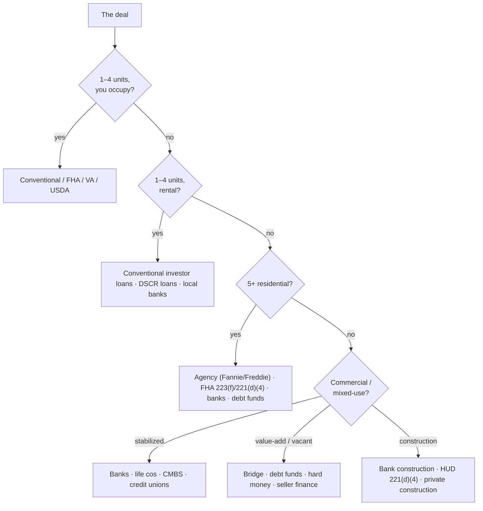

# The lender landscape

*Last reviewed: 2026-09. What each lender type actually underwrites to, and how to match a
deal to money. Ranges are typical shapes, not quotes — credit boxes move quarterly. Teaching
companions: [Capital & structure C1–C7](../../curriculum/courses/05-capital-structure.md),
[N3 — the survival numbers](../../curriculum/courses/03-the-numbers.md).*

---

## Contents

1. [The map: match deal to lender](#1-the-map-match-deal-to-lender)
2. [Residential 1–4 unit lenders](#2-residential-14-unit-lenders)
3. [Agency and government multifamily](#3-agency-and-government-multifamily)
4. [Banks and credit unions](#4-banks-and-credit-unions)
5. [CMBS, life companies, debt funds](#5-cmbs-life-companies-debt-funds)
6. [Private, hard money and creative](#6-private-hard-money-and-creative)
7. [Construction and development money](#7-construction-and-development-money)
8. [Mission and program lenders](#8-mission-and-program-lenders)
9. [The matching matrix](#9-the-matching-matrix)
10. [How the state changes the terms](#10-how-the-state-changes-the-terms)
11. [Finding actual lenders, any market](#11-finding-actual-lenders-any-market)

---

## 1. The map: match deal to lender

The triangle that decides everything — **LTV, DSCR, debt yield; one constraint binds at a
time** — is [C3's course](../../curriculum/courses/05-capital-structure.md). Whatever the
sheet says, coverage is the survival test ([C1](../../curriculum/courses/05-capital-structure.md)).

## 2. Residential 1–4 unit lenders

| Type | Shape | Where it breaks |
|------|-------|-----------------|
| Conventional conforming (Fannie/Freddie via any lender) | To ~10 financed properties per borrower; investor LTV ~75–80%; priced off LLPAs | Entity ownership; >10 properties; condition |
| FHA (203(b), 203(k) rehab) | Owner-occupied 1–4 only — the house-hack channel; low down | Investor use prohibited; MIP for life at high LTV |
| VA / USDA | Eligible borrowers/rural areas, ~0 down | Occupancy + eligibility bound |
| **DSCR loans** (non-QM) | Underwrites the *property's* rent coverage, not your income; entity-friendly; 30-yr terms | 1.0–1.25× DSCR floors; rate premium; prepay penalties |
| Local banks / CUs (portfolio) | Flexible on condition/entity; relationship-priced | Balloon structures; deposit-relationship expectations |

## 3. Agency and government multifamily

The cheapest permanent money in the country for 5+ units — and the slowest.

- **Fannie Mae DUS / Freddie Mac Optigo** — via licensed lender networks (Walker &
  Dunlop, Berkadia, Arbor, Greystone, CBRE…). Typical: 55–80% LTV, ≥1.25× DSCR,
  non-recourse with bad-boy carve-outs, 5–30 yr. **Small Balance** programs
  (Freddie SBL $1–7.5M, Fannie Small) reach deals local banks used to own.
- **FHA/HUD 223(f)** (refi/acquisition) and **221(d)(4)** (construction/sub rehab) —
  35–40 yr fully amortizing, highest leverage in the market, non-recourse; the cost is
  time (6–12+ months) and Davis-Bacon wages on d(4).
- **HUD 232** (senior/care), **242** (hospitals) — specialty.
- Find the current lender lists on HUD's approved-lender roster and the agencies' Optigo/DUS
  pages; the same shops broker most of it.

## 4. Banks and credit unions

The default CRE lender under ~$10M. Recourse is the norm; the relationship *is* the product
([E2's relationship map](../../curriculum/courses/01-emotional-equity.md)).

- **Community banks** — know the submarket, lend on assets nationals won't touch,
  5-yr balloon / 20–25-yr am typical, covenant-light but personal-guarantee-heavy.
  Regulatory CRE-concentration limits make their appetite cyclical — when one bank is
  full, the next one two towns over is not.
- **Credit unions** — member-based, often aggressive on small CRE; no prepayment
  penalties by statute in many cases — the refinance-optionality sleeper.
- **Regional/national banks** — better pricing, tighter boxes, treasury-management
  strings.
- Screening tool: FFIEC call reports / UBPR show any bank's CRE concentration and
  delinquencies — find the banks whose book says they want your asset class.

## 5. CMBS, life companies, debt funds

- **CMBS (conduit)** — non-recourse, cash-out-friendly, ~$2M+; the trade-offs are
  defeasance/yield-maintenance prepay and servicer rigidity in trouble (C7's
  securitisation guide is the anatomy). Watch Trepp prints for where the market is.
- **Life companies** — lowest rates on low-leverage (≤65%) stabilized quality; long
  fixed terms; correspondent-broker access.
- **Debt funds / mortgage REITs** — bridge and transitional lending, 70–80% of cost,
  floating, fast; the refinancing cliff is yours to model
  ([N7 — which input decides](../../curriculum/courses/03-the-numbers.md)).

## 6. Private, hard money and creative

- **Hard money / private lenders** — asset-based, 65–75% LTV (or ARV-based on flips),
  fast, expensive; the bridge to a story lenders can't read yet.
- **Seller financing** — [C4's whole course](../../curriculum/courses/05-capital-structure.md):
  the seller is a lender you have not asked yet. Installment sales, wraps
  (due-on-sale risk is real — counsel first), land contracts (state consumer rules
  tightening — see state entries).
- **Subject-to / assumptions** — FHA/VA/USDA loans are assumable with qualification; in
  a high-rate tape an assumable 3% note is worth real money in the exit
  ([O gate arithmetic](../states/README.md)).
- **Private notes / SD-IRA money** — relationship capital, securities rules apply the
  moment you pool (see the compliance note in [C5](../../curriculum/courses/05-capital-structure.md)).

## 7. Construction and development money

- **Bank construction loans** — recourse + completion guarantees, draws against
  inspections, interest reserves; converting to perm via mini-perm or agency takeout.
- **HUD 221(d)(4)** — the patient non-recourse construction option (see §3).
- **C-PACE** — assessment-secured capex/retrofit financing, state-enabled (about 40
  states; the state entries flag active ones) — long-term, transferable, senior-lien
  friction with mortgage lenders is the negotiation.
- **EB-5, opportunity-zone equity, mezz/pref** — capital-stack fillers with their own
  clocks; the waterfall math is [C5](../../curriculum/courses/05-capital-structure.md).
- **Land/A&D lending** — the scarcest bank product; local banks and private money only;
  feasibility gates ([D4](../../curriculum/courses/06-development-delivery.md)) decide it.

## 8. Mission and program lenders

- **State HFAs** — every state's is named in the [quick reference](../states/README.md#the-50-state-quick-reference):
  buyer loans and DPA on the residential side, bond-financed multifamily and LIHTC
  allocation on the other. The HFA is the front door to the whole
  [state program layer](state-county-programs.md).
- **CDFIs** (community development financial institutions) — flexible gap and
  predevelopment capital in underserved markets; find them via the CDFI Fund's award
  database (LISC, Enterprise, Reinvestment Fund, IFF and hundreds of locals).
- **SBA** — **504** (owner-occupied CRE, 51%+ occupancy, ~10% down through a CDC) and
  **7(a)**: the owner-user channel that turns a business tenant into a buyer.
- **USDA** — 538 (rural rental construction guarantee), B&I guarantees, 502 direct —
  "rural" reaches further than people assume; check the eligibility maps.
- **Land banks / municipal lending** — rehab loan pools, heritage/façade funds — the
  [county taxonomy](state-county-programs.md) covers finding them.

## 9. The matching matrix

The v1.2 mapping: deal shape → the lender types that actually underwrite it, with the
typical constraint bands. **Bands are shapes, not quotes** — every cell moves with the
cycle; the courses that teach each test are linked so the numbers are computed, not
believed.

| Deal shape | First calls | Typical DSCR floor | Typical LTV/LTC ceiling | Typical size band | The binding test to run first |
|------------|-------------|--------------------|--------------------------|-------------------|-------------------------------|
| 1–4 unit rental, stabilized | Conventional investor · DSCR lenders · local banks | 1.00–1.25× (DSCR loans) | 75–80% | <$1M–$2M | Rent evidence quality ([N3](../../curriculum/courses/03-the-numbers.md); asks are not leases) |
| 1–4 unit, heavy rehab | Hard money (ARV-based) · 203(k) if owner-occupied | n/a (asset/ARV) | 65–75% of ARV | <$1M | Exit debt: who refinances you out ([C2](../../curriculum/courses/05-capital-structure.md)) |
| 5+ multifamily, stabilized, $1–7.5M | Agency small-balance · community banks · credit unions | 1.20–1.25× | 75–80% | $1–7.5M | The lender's triangle — which constraint binds ([C3](../../curriculum/courses/05-capital-structure.md)) |
| 5+ multifamily, stabilized, $7.5M+ | Agency DUS/Optigo · life cos (low leverage) · CMBS | 1.25× (agency); 1.20–1.35 cycle-dependent | 55–80% | $7.5M+ | Debt yield in a rising-rate tape ([C3](../../curriculum/courses/05-capital-structure.md)) |
| Multifamily value-add / transitional | Debt funds (bridge) · banks with reserves · hard money | underwritten to *stabilized* 1.20–1.25× | 70–80% of **cost** | $2M+ | The refinancing cliff ([N7](../../curriculum/courses/03-the-numbers.md) — which input decides) |
| Multifamily new construction | Bank construction · HUD 221(d)(4) · private construction | 1.15–1.25× on stabilized pro forma | 65–75% LTC (bank); higher on d(4) | $3M+ | Feasibility gate with kill criteria ([D4](../../curriculum/courses/06-development-delivery.md)) |
| Affordable (LIHTC/HAP) | Agency affordable desks · HFA bond loans · CDFIs | 1.15–1.20× | to 90%+ with subordinate stack | varies | The credit calendar vs the construction clock ([state-administrators](state-administrators.md)) |
| Owner-occupied commercial (51%+) | SBA 504 · SBA 7(a) · local banks | business cash flow, not property DSCR | ~90% combined (504) | <$15M | The business's debt service, not the building's ([F3](../../curriculum/courses/02-foundations.md)) |
| Stabilized retail/office/industrial | Banks · life cos (quality) · CMBS ($2M+) | 1.25–1.40× | 60–75% | $1M+ | WALT vs loan term ([A6](../../curriculum/courses/04-the-asset.md)) |
| Land / A&D | Local banks · private money · seller carry | n/a | 50% or less | small | Residual land value ([D4](../../curriculum/courses/06-development-delivery.md)); the scarcest money on this table |
| Seller-financed anything | The seller ([C4](../../curriculum/courses/05-capital-structure.md)) | negotiable — that is the point | negotiable | any | The seller's actual need ([E5](../../curriculum/courses/01-emotional-equity.md) — negotiate the sequence) |

Read a row left to right, then run §10's state adjustments below — a judicial-state
bridge deal and a nonjudicial-state bridge deal are not the same product at the same
price.

## 10. How the state changes the terms

The same lender prices the same building differently across a state line:

| State fact (see [state guides](../states/README.md)) | Term consequence |
|------------------------------------------------------|------------------|
| Judicial foreclosure (NY, NJ, FL, IL…) | Longer recovery → pricier default risk → tighter boxes at the margin |
| Nonjudicial + fast (GA, TX, TN, MO…) | Speed priced in; bridge lenders concentrate here |
| Anti-deficiency / one-action (CA, AZ, NC purchase-money…) | Recourse structure changes; carve-outs matter more |
| Post-sale redemption (MI, MN, KS, WY…) | REO seasoning cost in the model |
| Non-disclosure states (TX, LA, MT, WY…) | Appraisal-dependence rises; DSCR loans lean harder on rent evidence |
| Insurance-crisis coasts (LA, FL, CA wildfire) | Quoted-premium DSCR is the binding test — [the state entries say it](../states/south-central.md#louisiana) |
| Property-tax reset rules (CA reset on sale vs OR never) | Underwritten tax line differs from the seller's — both directions |

## 11. Finding actual lenders, any market

Patterns that outlive any directory:

1. **Pull the mortgages.** The recorder's index shows who lends on your asset type in
   that county *right now* — grantee names on recent deeds of trust are your call list.
   This is the platform's own method: the record over the brochure.
2. **Call reports** (FFIEC) for banks whose book fits; **NCUA** equivalents for CUs.
3. **HUD/agency rosters** for approved multifamily shops.
4. **The HFA's participating-lender list** — every state HFA publishes one.
5. **Title/escrow officers and the trustee bar** know which lenders close — the E2
   relationship map, applied.
6. **CDFI Fund award lists** for mission capital near the parcel.
